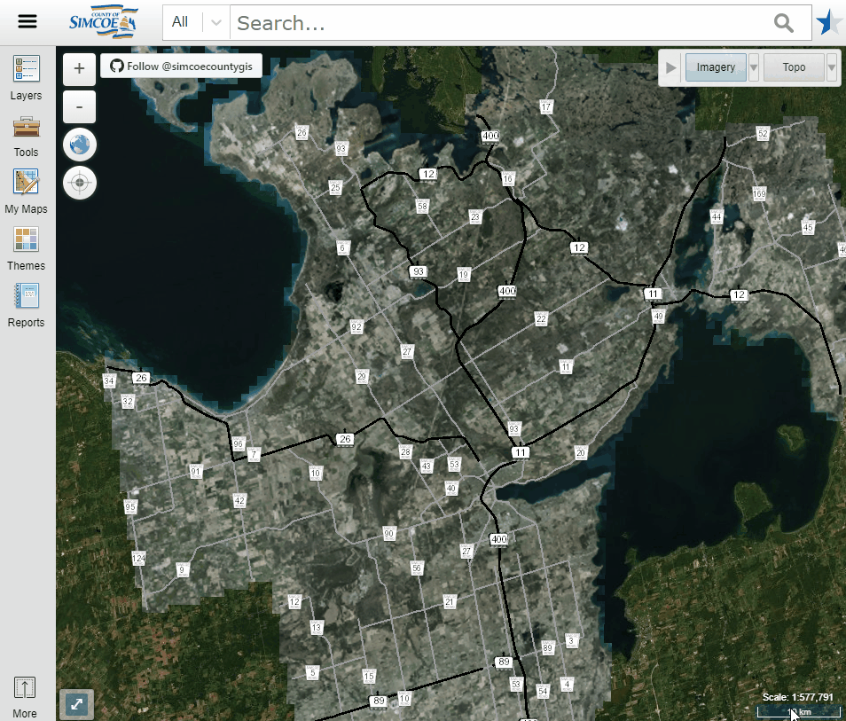
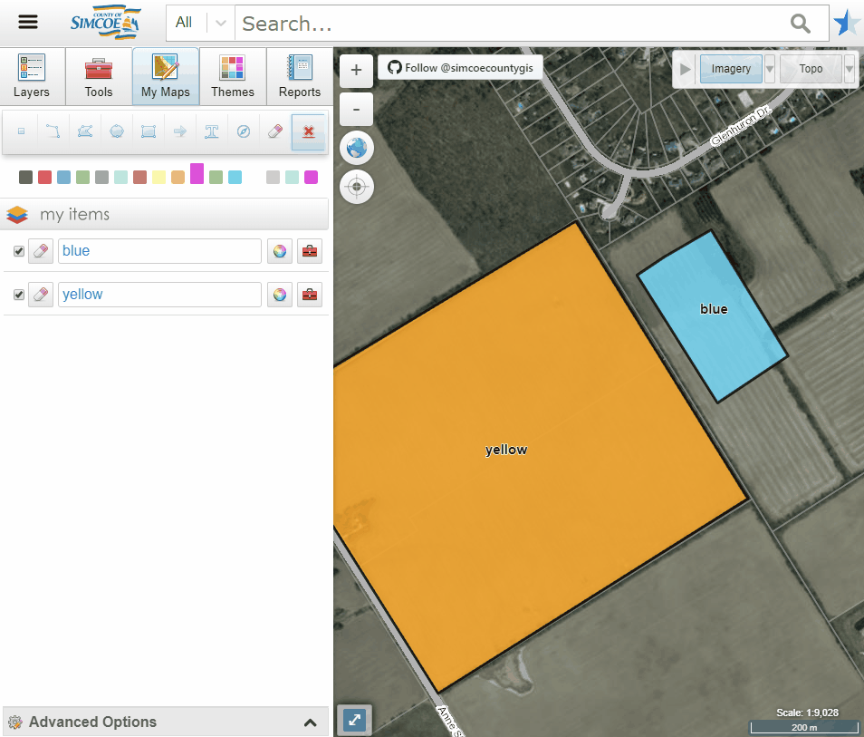
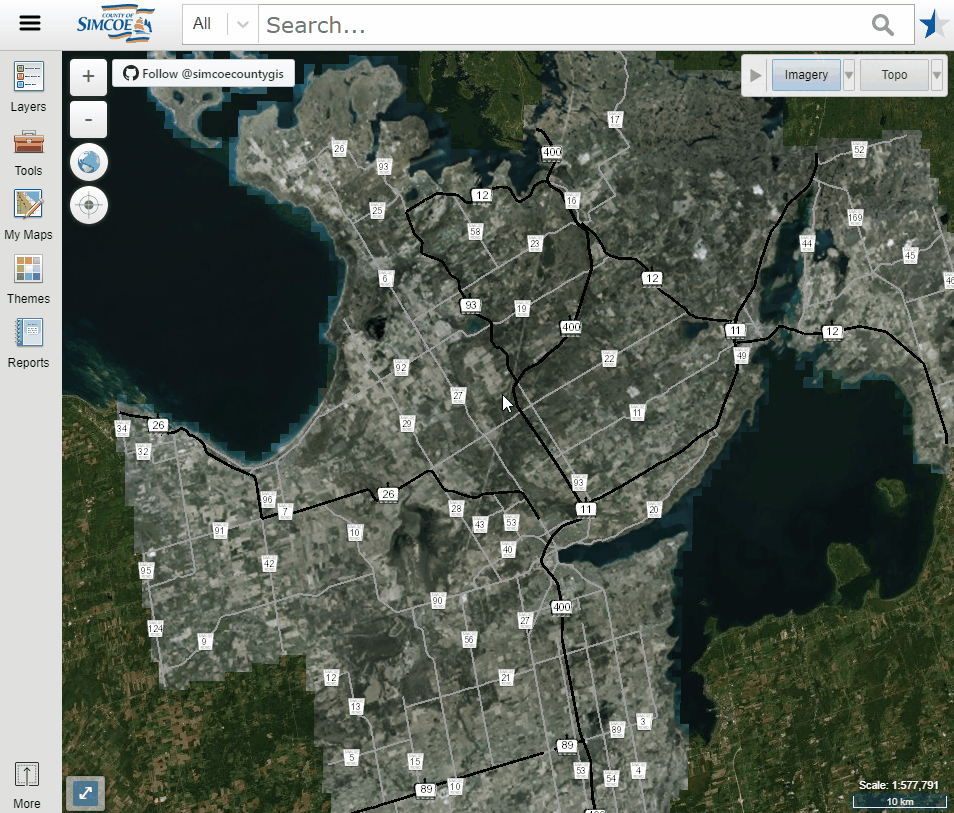

# Simcoe County Beta What's new 
<!--   Introductions   -->
## Introduction
 Simcoe County has made some new updates to our OpenGIS site. This latest version includes many useful new features and enhancements in the beta. Please check [below](#search) to see additional details in the new udpates 

* [Search Panel](#search)
* [Imagery / Topo Panel](#imagery)
* [Navigation Panel](#navigation)
* [Other Enhancements](#other)

<!--   Main Content   --> 
 

## Search Bar
Searching could be easier with the assit of "Search by Types" and the "Show More" button.

* Search by Types
* Show More Button

## Imagery / Topo Panel : Switch Maps
DIfferent imageries and topological basemaps can be switched in the drop-down menu now.

* Switch Basemaps

## Navigation Panel
Some more features have been added to Navigation panel on the left.

### _Layers_
* Re-order layers
* Sorting A-Z
* Context menu
* Additional tools
<!--   layers panel gif   -->

### _My Maps_
* Improved Sharing: Import & Save
<!--   maps panel gif   -->

## Other Enhancements

### Right-Click Menu
Right Click the map window for more options (e.g. Switch To Basic)

