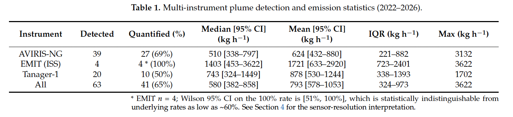

{/* Checked against the published paper (Mining 2026, 6, 35) on 2026-10-07. Set draft: false to publish.
    Optional: add the paper's Figure 4 (emission rate vs. HRRR wind speed, with the success rate per wind bin) under "Findings".
    The paper is open access (CC BY), so its figures can be reused with credit.
    Note: the hero image (graphical abstract) and the paper's Figure 5a print OR = 0.325; the paper's text and Table 3 say 0.29. */}

## Background

Coal mining is a major human source of methane, yet emissions from individual mines are poorly measured. A new generation of imaging spectrometers can now see single plumes: AVIRIS-NG from aircraft, EMIT on the International Space Station, and the Tanager-1 satellite. But a plume image is not an emission rate. Turning one into the other needs the wind, and in mountain terrain the wind is exactly what's hard to know.

## Study Site

Fording River Operations is an open-pit metallurgical coal mine in the Elk Valley of southeast British Columbia. It sits in a narrow Rocky Mountain valley at 1,400–1,800 m, with peaks above 2,500 m. Valley-channelled winds, frequent calm spells, and cloud make it a demanding test for measuring methane from aircraft and satellites.

## Approach

- **Plumes**: detections and emission estimates from the public Carbon Mapper portal, for all three instruments.
- **Quantification**: the integrated mass enhancement (IME) method, Q = IME × Ueff / L. The wind comes from the aircraft's own measurements for AVIRIS-NG and from the HRRR weather model (~3 km grid) for EMIT and Tanager-1.
- **Wind check**: HRRR compared with ERA5-Land reanalysis (~9 km grid) at every plume.
- **Statistics**: logistic regression of whether a plume was quantified against HRRR wind speed, with cross-validation and sensitivity checks.

## Findings

- Across 63 plumes from 19 overpass sessions (January 2022–March 2026), 41 (65%) could be quantified, with emission rates from 33.6 to 3,621.9 kg CH₄/h (median 580 kg/h). Of those, 22 (54%) were above the 500 kg/h super-emitter threshold.
- Quantification depended on the modelled wind: each extra 1 m/s of HRRR wind cut the odds of getting an emission estimate by about 70% (odds ratio 0.29, AUC 0.80). Below 2 m/s, more than 80% of plumes were quantified; above it, about 40%.
- HRRR and ERA5-Land agreed only moderately (r = 0.63, RMSE 0.88 m/s), and the gap split by outcome: for unquantified plumes HRRR ran 0.86 m/s (43%) above ERA5-Land; for quantified plumes the gap was almost zero (−0.09 m/s).
- The gap was similar for along-valley and cross-valley winds, so valley channelling alone doesn't explain it. A stable, decoupled layer of air near the ground may explain it instead, though without stability data this remains a hypothesis.

## What I Took Away

Wind determines whether a plume can be quantified. About 1/3 of detected plumes received no emission estimate. They clustered where the weather model reported stronger wind, but the valley air was likely calmer than the model said.

Those missing estimates bias emission statistics. Leaving them out pushes the facility mean up: if they emitted at a fifth to half of the quantified mean, the mean over all plumes would be about 18–28% lower. Inventories should report the quantification rate alongside the mean.

In mountainous terrain, the wind is the weak link. Wind errors carry directly into emission estimates, and at this site the wind alone leaves each estimate with roughly 28–44% uncertainty. Wind measured on site should come before these estimates are used in regulatory inventories.

Differences between instruments are mostly about conditions, not quality. Tanager-1's lower success rate (50% vs. 69% for AVIRIS-NG) likely reflects higher modelled wind during its overpasses, and EMIT's four out of four reflects its coarse 60 m pixels averaging the plume, not better accuracy.

The findings come from one site and depend on Carbon Mapper’s retrievals and emission estimates. The wind comparison is between models, without ground anemometer measurements to validate them. Most detections (73%) fall in September and none in 2023, so the results describe late summer.

*Hu, K. J., Chai, Y., Asgarpour, S., Boudreault, R., Li, J., & Yin, S. (2026). Methane Detection of Super-Emitters by Remote Sensing and Investigation of Wind-Driven Bias in Complex Terrain: A Multi-Instrument Analysis. Mining, 6(2), 35. [doi:10.3390/mining6020035](https://doi.org/10.3390/mining6020035)*
