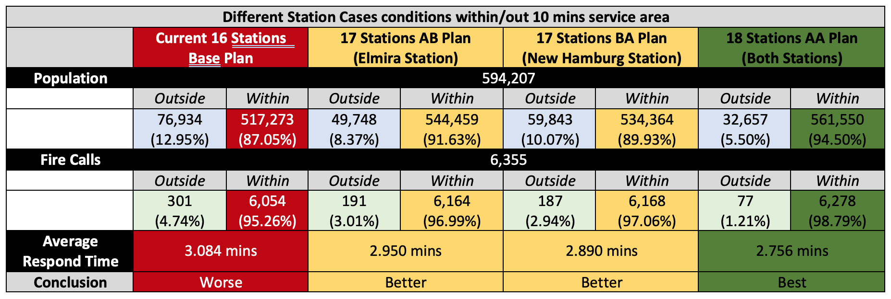
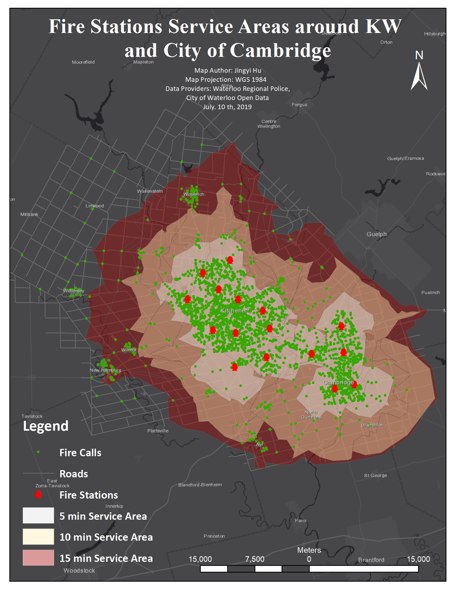

The map above presents the current service coverage of Waterloo fire stations across **5-, 
10-, and 15-minute response thresholds**. Service areas are generated through **network-based 
travel-time modeling**, using observed fire-call data to ensure results reflect **real operational 
conditions** rather than Euclidean distance assumptions.

The grouped maps below benchmark the **existing station configuration** against three proposed 
deployment scenarios. Each alternative is quantitatively evaluated by its ability to **maximize 
10-minute response coverage**, enabling a **data-driven comparison of operational efficiency and 
emergency responsiveness** across the Waterloo region.

