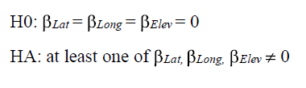
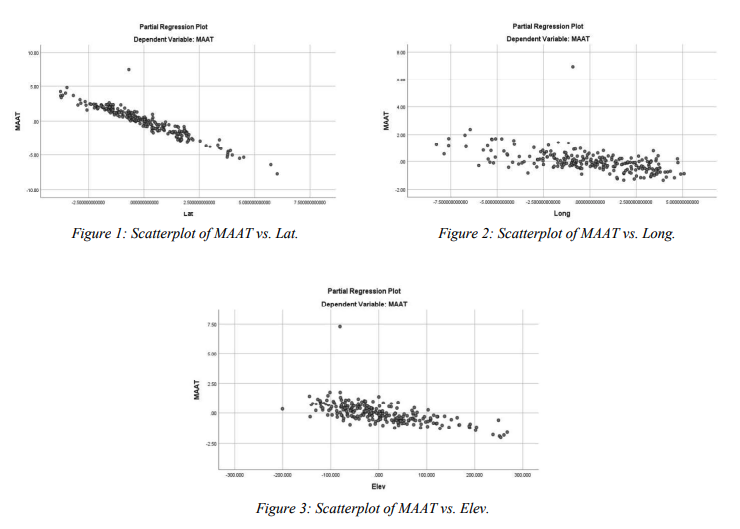
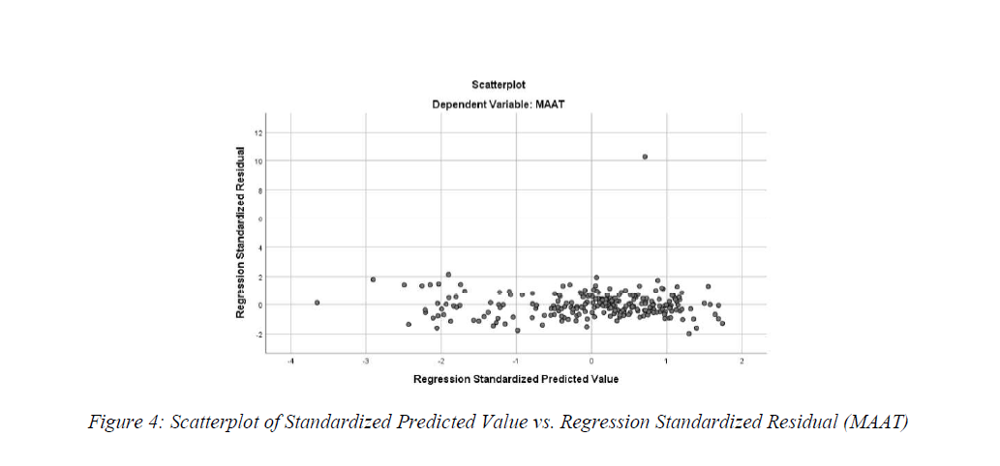
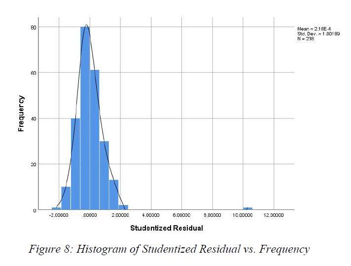
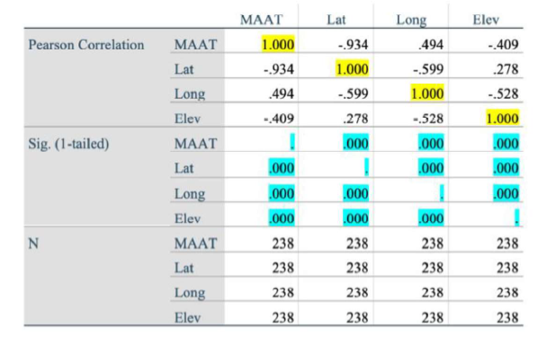
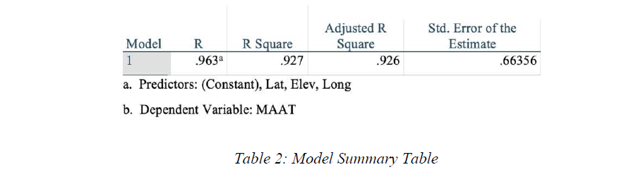
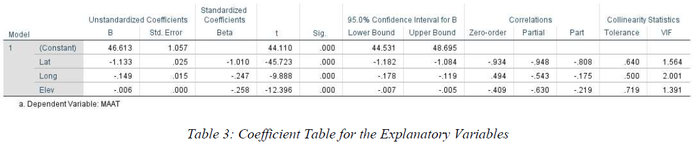
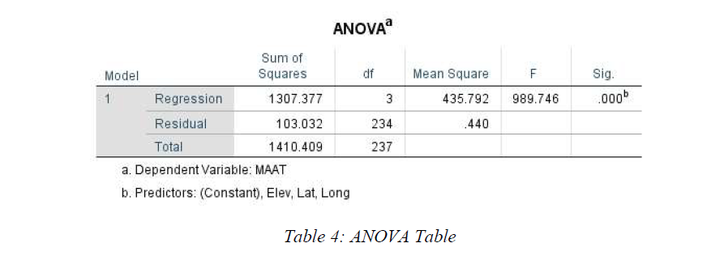
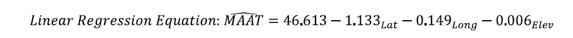

### Background

The dataset from Environment and Climate Change Canada contains the Mean Annual Air Temperature (MAAT) for weather stations 
across Ontario, along with station name, latitude, longitude, and elevation. MAAT values were calculated over the 1981–2010 
climate normal period, and only stations with at least 15 years of valid records were included.

Based on fundamental climatological principles, MAAT is expected to:

- Decrease with **latitude**↑ (northward cooling),
- Decrease with **elevation**↑, ~**0.5–1.0°C per 100 m** (env lapse rate),
- Exhibit weaker gradients in the **east–west (longitude)** direction compared to north–south variation.

This study applies a multiple linear regression model to evaluate whether these geographic controls are statistically significant 
predictors of MAAT in Ontario and to quantify the direction and magnitude of temperature change associated with latitude, longitude, 
and elevation.

### Hypothesis

The response variable is **MAAT**, and the explanatory variables are **latitude, longitude, and elevation**.

- **Null hypothesis (H₀):**  
  β₁ = β₂ = β₃ = 0  
  (Latitude, longitude, and elevation have no linear relationship with MAAT.)

- **Alternative hypothesis (H₁):**  
  At least one regression coefficient βᵢ ≠ 0  
  (At least one explanatory variable has a statistically significant relationship with MAAT.)

{/*  */}

### Assumptions and Conditions

**Linearity Assumption (Straight Enough Condition)**

Scatterplots of MAAT versus latitude, longitude, and elevation (Figures 1–3) show no strong curvature or systematic nonlinear patterns.  
Although minor outliers are present, they do not materially affect the overall linear trend.  
Residual plots (Figure 5) also show no structure indicative of nonlinearity.

**Independence Assumption (Randomization Condition)**

Each weather station represents a distinct geographic location, and measurements at one station do not directly influence those at another.  
While spatial autocorrelation is possible in climatological datasets, no clear spatial pattern is evident in the residual diagnostics (Figure 4).  
Thus, independence is assumed as a reasonable approximation.

**Equal Variance Assumption (Homoscedasticity Condition)**

Residual plots (Figures 4–7) show relatively constant variance across fitted values and across all explanatory variables.  
There is no evidence of systematic widening or narrowing of residual spread, indicating that the equal variance assumption is satisfied.

**Normality Assumption (Nearly Normal Condition)**

The studentized residuals (Figure 8) exhibit an approximately symmetric and unimodal distribution.  
Although one high residual is observed, the overall distribution remains close to normal.  
Given the sample size, this outlier is unlikely to materially affect parameter estimates.

### Multiple Linear Regression Model

**Variable Relationships**

The above table summarizes Pearson correlation coefficients between MAAT and the three explanatory variables.

- All correlations are statistically significant (**p ≤ 0.0001**).
- **Latitude** shows a very strong negative correlation with MAAT (r = −0.934), indicating dominant north–south temperature control.
- **Longitude** (r = 0.494) and **elevation** (r = −0.409) show moderate but meaningful linear relationships with MAAT.

These results support the inclusion of all three variables in the regression model.

The overall multiple correlation coefficient is **R = 0.963**, indicating a strong linear relationship between MAAT and the combined set of predictors.

### Linear Regression Equation

The general multiple linear regression model is:

Substituting the estimated coefficients from Table 3 yields the fitted regression equation:

Unstandardized coefficients (B) are used for interpretation, as they retain the original units of the explanatory variables.

### Interpretation of the MLR Model

**Overall Model Significance**: The ANOVA results show an **F-statistic of 989.746**, with a corresponding **p-value ≤ 0.0001**.  
This provides strong evidence against the null hypothesis, indicating that the model is statistically significant.

**Goodness of Fit**: The coefficient of determination (**R² = 0.926–0.927**) indicates that approximately **92.6–92.7%** of the 
variability in Ontario MAAT is explained by latitude, longitude, and elevation.

### Relationship Between MAAT and Explanatory Variables

**Latitude**: For each 1° increase in latitude northward, MAAT decreases by approximately **1.133°C**, holding other variables constant.

**Longitude**: For each 1° movement westward, MAAT decreases by approximately **0.149°C**, reflecting a weaker east–west temperature gradient.

**Elevation**: For each 1 m increase in elevation, MAAT decreases by approximately **0.006°C**, equivalent to **0.6°C per 100 m**, which is consistent with expected climatological lapse rates.

### Confidence Intervals

At the 95% confidence level:

- A 1° increase in latitude corresponds to a MAAT decrease between **1.084°C and 1.182°C**.
- A 1° increase in longitude westward corresponds to a MAAT decrease between **0.119°C and 0.178°C**.
- A 1 m increase in elevation corresponds to a MAAT decrease between **0.005°C and 0.007°C**.

### Hypothesis Conclusion

Given the large F-statistic (989.746) and the extremely small p-value (≤ 0.0001), the **null hypothesis is rejected**.  
Latitude, longitude, and elevation all have statistically significant linear relationships with Ontario MAAT.

Overall, the regression results align well with established climatological expectations, confirming latitude as the dominant control on temperature, with elevation and longitude providing meaningful secondary influences.
