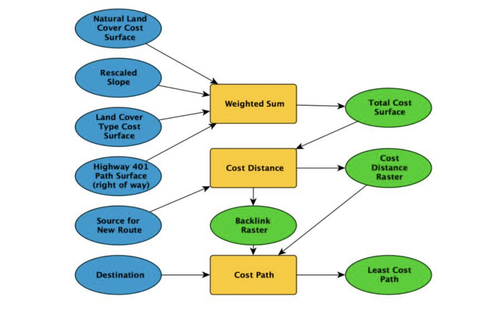
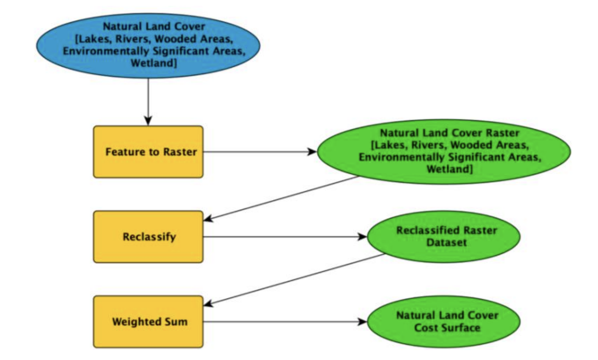
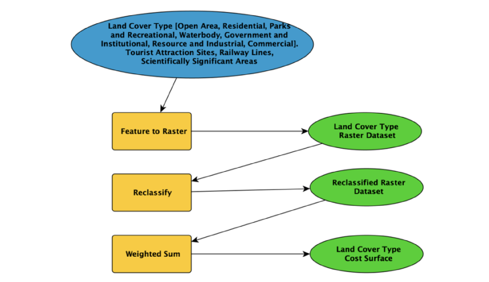
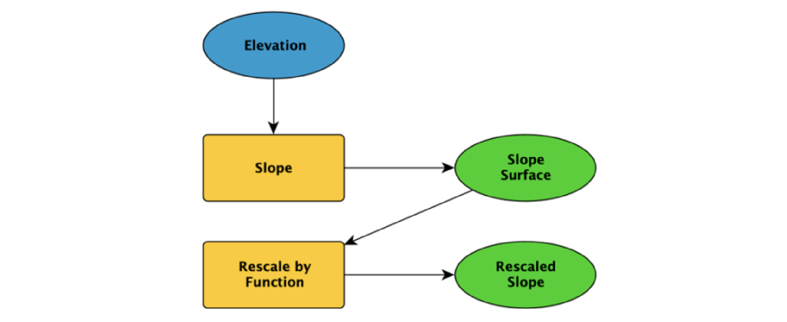

## Background

Transit infrastructure development is a major necessity in Canada’s largest city and the capital of Ontario, Toronto. As
one of the busiest highways in North America and the backbone of Toronto's transportation and distribution system,
provincial Highway 401, carries over 416 thousand annual average daily traffic (AADT) and plays an important role in
the Ontario southern road network (You et al., 2017). With economic development and ongoing urbanization, the
increasing regional population brings up traffic congestion in the system, especially during peak hours. The existing
transportation condition has proved a bottleneck under the ongoing globalization & increasing population in the city. To
mitigate the congestion, this paper proposed a new bypass route plan on Highway 401 by combining the least cost path
analysis (LCPA) and multiple-criteria evaluation (MCE).

 Figure 1. Highway 401 Traffic Congestion Area

 Figure 2. Least Cost Path Analysis (LCPA) 

We used LCPA (shown above) as the major solution in the study since it can successfully facilitate informed decision-making
in transportation infrastructure planning and design. Moreover, it enables a thorough consideration of various forms of
costs in highway construction through multiple criteria cost surfaces to generate the cheapest cost route (Sari & Sen,
2017). The analysis allows for a user-defined solution by allowing a wide range of measures for “cost” through translating
and communicating ordinal scales of measure via numeric values. The least cost path analysis has been successfully
applied to a wide range of problems in existing research with the most popular application being infrastructure
development and design (Bagli et al., 2011).
The primary objective of this research is to apply the least cost path analysis to develop a new bypass route that will divert
traffic from regularly congested segments and gridlocks identified on highway 401 in the city of Toronto thereby
alleviating traffic congestion and its associated environment, economic and health impacts. Specifically, the key
contributions included:

1. Identifying a key segment on highway 401 where the bypass route needs to be introduced along the 401 based 
on existing traffic congestion trends.
2. Defining a set of criteria to be applied to define costs towards generating the least cost path.
3. Generating and mapping a cost-effective bypass route on highway 401.
4. Quantification of the results of the least cost path analysis and performance assessment through network analysis

 Figure 3. Environmental Impacts Cost Surface

Three major criteria of cost surfaces were defined during the initial stage, and a scale of 1 to 10 was used for the measure
of cost. Highest weight was attributed to environmental costs in this analysis to attain the most environmentally friendly
outcome possible. Allocation of costs and weights was based on research to make educated comparisons between sub
criteria for cost surfaces and between criteria for total cost surfaces. An additional criterion of the right of way of the
current 401 route was included to avoid the new bypass route from being generated directly on top of the 401 or from
overlapping over it. However, this region of path was not part of the cost criteria for the bypass route but only aimed at
facilitating the analysis. Following the creation of the total cost surface from all the defined criteria, a cost distance and
a backlink raster were created. The cost distance raster surface represents costs of distances with reference to the source
location.

 Figure 4. Land Cover Type Cost Surface

 Figure 5. Slope Surface

Environmental impacts, land cover types, and slopes were considered during the generation of the LCPA surface while
user-defined classes were integrated into the MCE (shown in figure 3, 4, & 5). In Addition, the LCPA+MCE results were
quantified and visualized with a series of performance assessments (PA) including buffer analysis (BA) as well as network
analysis (NA). The PAs outputs were presented and discussed in the paper to verify whether the use of LCPA+MCE in
the decision-making & planning stage would make the model perform better by adapting various real-life MCE facts in
this case study

---

 *Presented at <a href = "https://ica-abs.copernicus.org/articles/6/94/2023/"> ICC 2023</a> · Cape Town, South Africa* 

