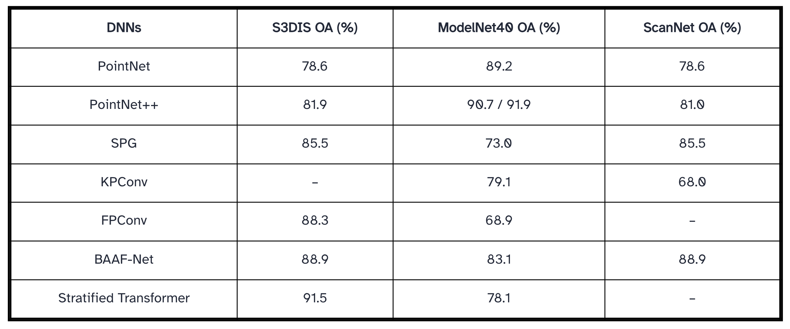
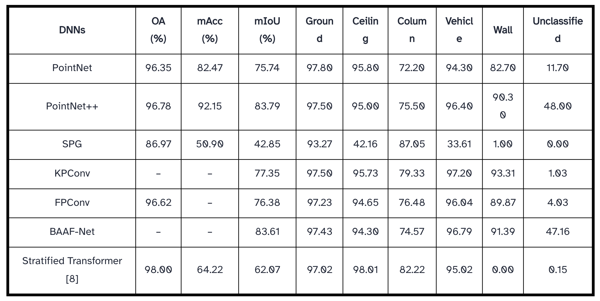
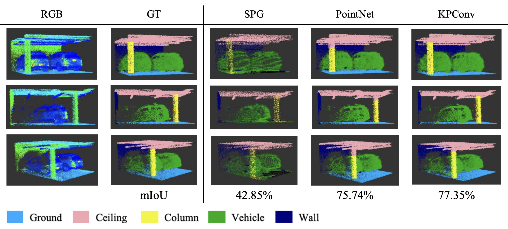
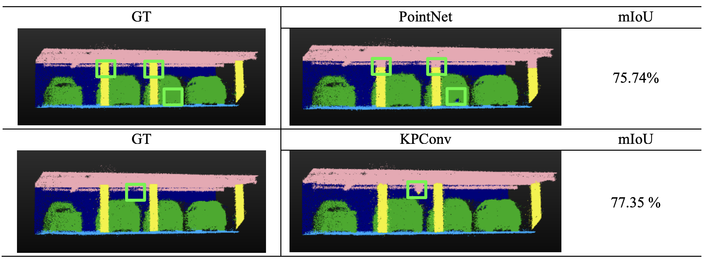

### Research Background
Deep neural networks (DNNs) in intelligent point cloud processing have achieved remarkable progress 
 in recent years. Most existing methods and models were adopted on either outdoor or indoor scenes while 
 very few previous studies were conducted in GNSS-denied environments. In this paper, we carried out a comparative 
 study in semantic segmentation outputs using different DNNs in an underground parking lot dataset. Manually labeled 
 indoor point cloud data were trained and tested using 7 different DNNs (e.g. PointNet, KPConv, FPConv, BAAF-Net, etc.).
 Our experiments demonstrated how well different DNNs perform in GNSS-denied environments with performance assessments 
 in mIoU, Mean Accuracy (mAcc), Overall Accuracy (OA), as well as visualization outputs. The main contribution of this 
 comparative study is to compare state-of-the-art DNN algorithms' performance in semantic segmentation directly on the 
 raw indoor mobile laser scanning (iMLS) data from a GNSS-denied underground parking lot and evaluate the effectiveness 
 and potentials of different DNNs in underground 3D taskings. Draw upon that, which current algorithms are optimal and 
 how future work in GNSS-denied environments can be inspired and implemented would be discussed.

**DNN's Semantic Segmentation Results on S3DIS, ModelNet40, and ScanNet**

---

### Dataset
The dataset used in the study is a GNSS-denied point cloud 
set collected from an underground parking lot using a 
Backpack Laser Scanning (BLS) system (Gong et al., 
2021) by the GIM lab, University of Waterloo. For better 
visualization purposes, the entire dataset, which contains 
approximately 154,122,306 points, has been sliced into 5 
separate kits shown in Figure 1. There are 6 manually 
categorized classes included in this underground parking 
lot dataset: 

- **Ground** (label 1): the ground surfaces with speed bumps and manholes. 
- **Ceiling** (label 2): ceilings, beams & pipes on the top of parking lots. 
- **Column** (label 3): all pillar and pole-like objects. 
- **Vehicle** (label 4): includes sedans, SUVs, and trucks. 
- **Walls** (label 5): walls & dividing walls in the middle of the parking lot. 
- **Unclassified** (label 6): unrecognizable objects.

---

### Methodology & Experiments
To enable a clearer comparison of semantic segmentation performance, qualitative visualization results were 
analyzed alongside quantitative accuracy metrics. The table presents subsampled outputs from different DNNs, 
where the first column shows the raw RGB point cloud, the second column displays the ground truth (GT), and the 
remaining columns illustrate model-specific segmentation results. Visual inspection reveals that SPG performs poorly, 
particularly in distinguishing vehicle, ground, and column classes, consistent with its low mIoU of 42.85%. In contrast, 
PointNet achieves a higher mIoU of 75.74%, with segmentation outputs more closely resembling the GT, while KPConv 
demonstrates the strongest performance among the models with an mIoU of 77.35%.

A detailed comparison between PointNet and KPConv highlights their error characteristics below: PointNet primarily 
misclassifies the upper portions of columns as ceiling, whereas KPConv occasionally labels wall regions as ceiling. As 
summarized in Table 4, PointNet’s class IoU ranges from 72.2% (column) to 97.8% (ground), while PointNet++ improves the 
overall mIoU by approximately 8% to 83.79%. SPG exhibits the lowest mIoU due to weak segmentation of ceiling (42.16%) and 
vehicle (33.61%). Both KPConv and FPConv show stable and balanced performance in the underground parking environment, with 
mIoUs of 77.35% and 76.38%, respectively. BAAF-Net achieves the highest mIoU (83.61%), whereas the Stratified Transformer 
(ST) attains the highest overall accuracy (98.00%) but suffers from class imbalance, resulting in a lower mIoU of 62.07%.

Except for SPG, all evaluated DNNs perform reliably in a GNSS-denied environment. The column class consistently 
exhibits the lowest IoU across models, indicating potential benefits from hybrid approaches, such as combining PointNet++ with 
ST to leverage ST’s strong column segmentation performance (82.22%). Future work may further explore transformer-based architectures 
to mitigate class imbalance, particularly for improving wall segmentation in GNSS-denied indoor environments.

---

### Conclusion & Future Work
To sum up, we did the first comparative study in
investigating the semantic segmentation performances of
state-of-art DNNs within GNSS-denied environments.
Based on the output, the mIoUs were mostly negatively
affected by the accuracy in segmentation of “column”
label. The BAAF-Net has the highest mIoU (83.61%) with
high and average IoUs for each class while the ST model
gets the highest OA (98.00%) with great output in all class
expect for “wall”.
Based on the quantitative result, future works can
contribute to proposing practice measures in refining the
3D taskings in GNSS-denied environments with optimized
DNNs. Besides, future contributions should focus on lowlevel taskings to generate better-quality underground
datasets (e.g., through point cloud correction and
completion). With an optimized and standardized model
specifically designed for GNSS-denied scenes, better
solutions for the development of digital twins and
autonomous driving can be applied in future. After that, we
shall move to the next stage for exploring, popularizing,
and commercializing 3D tasks in the industry for application in GNSS
-denied environments such as
underground parking lots. 

---

 *Presented at <a href = "https://doi.org/10.5194/ica-adv-4-18-2023"> ICC 2023</a> · Cape Town, South Africa* 

