import img01 from "./img/p4_2-a.png";
import img02 from "./img/p4_2-b.png";
import img03 from "./img/p4_2-c.png";
import img04 from "./img/p4_2-d.png";
import img00 from "./img/p4_2-e.png";

### Research Background

Indoor GNSS-denied environments represent one of the most challenging and least resolved scenarios in geospatial modelling. The complete 
absence of GNSS signals, compounded by severe occlusions from structural elements and vehicles, highly non-uniform point density, dynamic 
lighting conditions, and operator-dependent SLAM drift, fundamentally undermines the reliability of conventional mapping pipelines. Despite 
progress in outdoor HD mapping, indoor 3D semantic modelling lacks standardized, high-accuracy benchmarks, especially for indoor infrastructure-scale 
environments like parking garages.

**Research Question**: Can a LiDAR-based SLAM pipeline, augmented with semantic segmentation, surface reconstruction, and line 
extraction, produce a quantitatively reliable HD digital twin of an real-life GNSS-denied scene?

### Data Acquisition
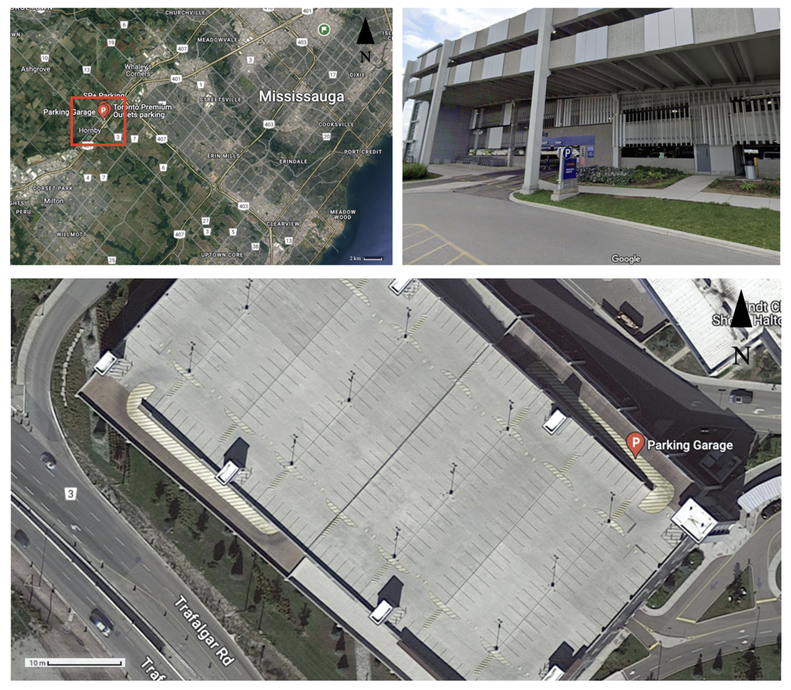
**Study Area**: Level 4, Indoor parking garage near Toronto Premium Outlets (GTA)
- **Area Covered**: ~12,000 m²
- **Data Collection Tool**: GeoSLAM ZEB Horizon Hand-held LiDAR
- **Acquisition Duration**: ~45 minutes
- **Point Cloud Size**: ~69 million points

**Trajectory**: SLAM quality is trajectory-dependent, which means operator motion directly impacts spatial fidelity. 
Trajectory and moving direction are shown below (star: the start & endpoint; arrows: moving direction)
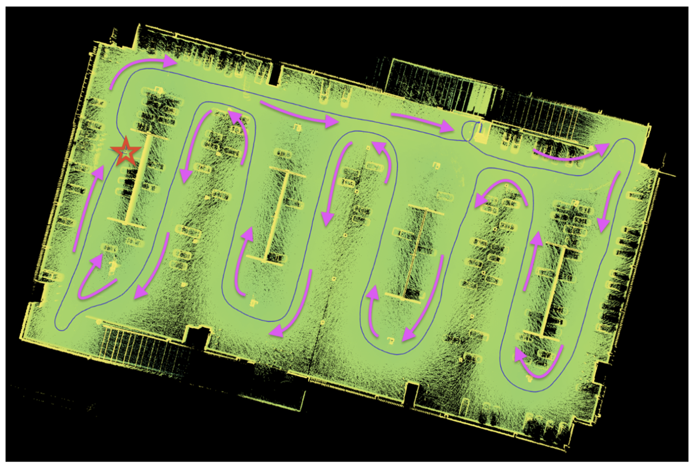

### Methodology Overview
**Stage 1: Point Cloud Preprocessing**

Seven semantic classes were defined to represent distinct object categories within the dataset. These include bollards 
(Class 01), walls (Class 02), pillars (Class 03), vehicles (Class 04), ceilings (Class 05), floors (Class 06), and an 
others/unclassified category (Class 07). Each class corresponds to a unique structural or functional element in the indoor 
parking environment, ranging from vertical safety features and load-bearing supports to horizontal navigable surfaces and 
miscellaneous residual points.

  <table class="perf-table">
    <thead>
      <tr>
        <th>Class ID</th>
        <th>Class Name</th>
        <th>Point Count</th>
        <th>Percentage (%)</th>
      </tr>
    </thead>
    <tbody>
      <tr><td>01</td><td>Bollard</td><td>127,625</td><td>0.19%</td></tr>
      <tr><td>02</td><td>Wall</td><td>5,842,108</td><td>8.50%</td></tr>
      <tr><td>03</td><td>Pillar</td><td>469,885</td><td>0.68%</td></tr>
      <tr><td>04</td><td>Vehicle</td><td>1,439,990</td><td>2.09%</td></tr>
      <tr><td>05</td><td>Ceiling</td><td>35,640,963</td><td>51.83%</td></tr>
      <tr><td>06</td><td>Floor</td><td>25,252,755</td><td>36.70%</td></tr>
      <tr><td>07</td><td>Others / Unclassified</td><td>4,970</td><td>0.01%</td></tr>
      <tr>
        <td colspan="2"><strong>Total</strong></td>
        <td><strong>68,778,296</strong></td>
        <td><strong>100%</strong></td>
      </tr>
    </tbody>
  </table>

{/* 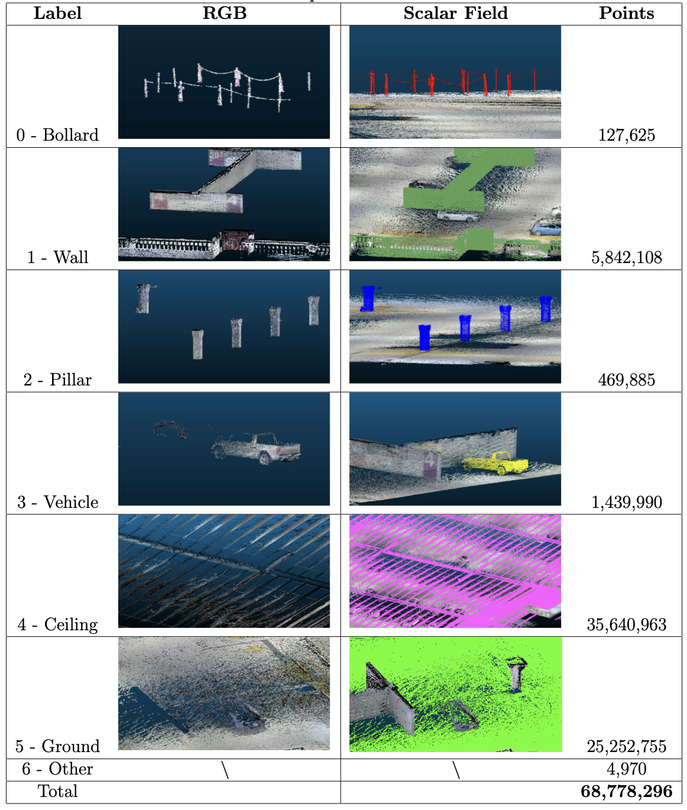 */}
For each class, subsets were generated in both RGB and scalar field formats, with corresponding point statistics summarized in 
table above. The distribution of points across classes is highly imbalanced: the bollard and pillar classes contain relatively 
few points (127,625 and 469,885, respectively), while the wall and vehicle classes comprise 5,842,108 and 1,439,990 points. 
Substantially higher point densities are observed for horizontal surfaces, with 25,252,755 points in the floor class and 35,640,963 
points in the ceiling class. The unclassified category contains only 4,970 points. In total, the filtered and smoothed dataset 
consists of 68,778,296 points prior to segmentation

---

**Stage 2 - Task 01**: Semantic Segmentation 
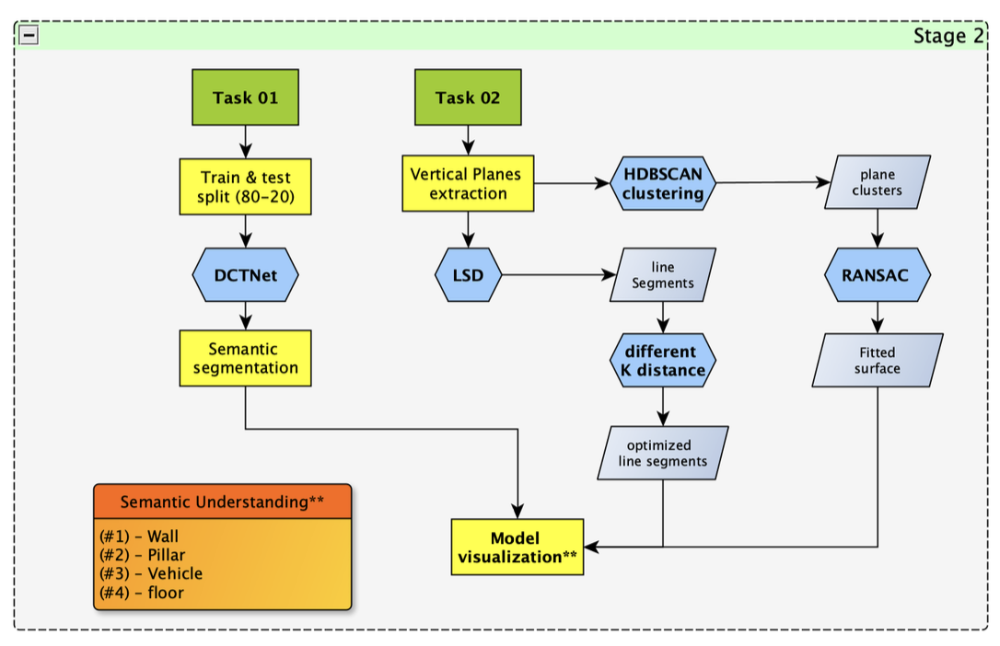

- Model: ***DCTNet*** *(Dynamic Clustering Transformer-based Network)*
- Epochs: **150**
- Batch size: **2**
- Optimizer: ***Stochastic Gradient Descent (SGD) optimizer***
- Learning rate: **0.01**
- Train | test split: ***80% | 20%***

For training, testing, and subsequent analysis, only four classes—wall, pillar, vehicle, and floor—were retained. The ceiling class was 
removed due to its limited relevance to navigable space and its tendency to occlude other structural features, while bollards and 
unclassified points were excluded because of their low point density and minimal impact on large-scale indoor navigation and surface 
reconstruction tasks.

To construct the training and testing datasets for semantic segmentation, the Pareto principle (80–20 split) was adopted, with 80% of 
the data used for training and 20% reserved for testing and validation. Because spatial data exhibit strong location-dependent variability, 
a random split may fail to capture regional diversity; therefore, manual spatial sampling was applied to ensure that both subsets adequately 
represent the full range of spatial patterns while minimizing geographic bias.

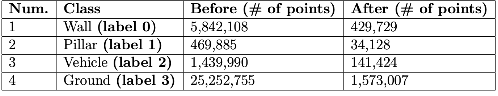

{/* **Training sets Details & Thumbnails (01–04.txt)** */}

  

    
Sliced Set

    
Point Size

    
Overview

    
<strong>01.txt</strong>

    
455,896

    

      
    

    
<strong>02.txt</strong>

    
526,430

    

      
    

    
<strong>03.txt</strong>

    
314,182

    

      
    

    
<strong>04.txt</strong>

    
489,057

    

      
    

  

- **All train (01–04.txt):** 2,285,565  
- **Coverage:** 1,785,565 / 2,278,288 (**78.4%**)

{/* **Testing sets Details & Thumbnails (00.txt)** */}

  

    
Sliced Set

    
Point Size

    
Overview

    
<strong>00.txt</strong>

    
492,723

    

      
    

  

- **All test (00.txt):** 492,723
- **Coverage:** 492,723 / 2,278,288 (**21.6%**)

Weights are assigned in the loss function of the model to handle class imbalance. A self-defined 
weight for each class generated and input into the DCT-Net model for training purposes. Based on the calculation, 
the weights for classes 1 to 4 are *1.2672451707936863* **(wall)**, *15.95675105485232* **(pillar)**, *3.8506335558321076* 
**(vehicle)**, and *0.34619807794879487* **(ground)**.

---

**Stage 2 - Task 02**: Structural Regularization

**Surface reconstruction**:

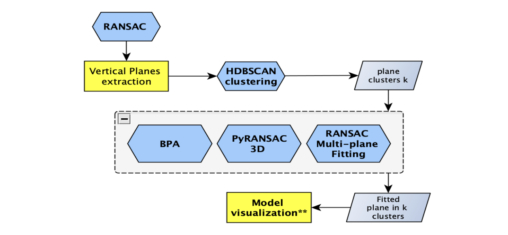
- HDBSCAN clustering
- BPA (Ball-Pivoting Algorithm)
- pyRANSAC-3D multi-plane fitting
---
**Line feature extraction**:

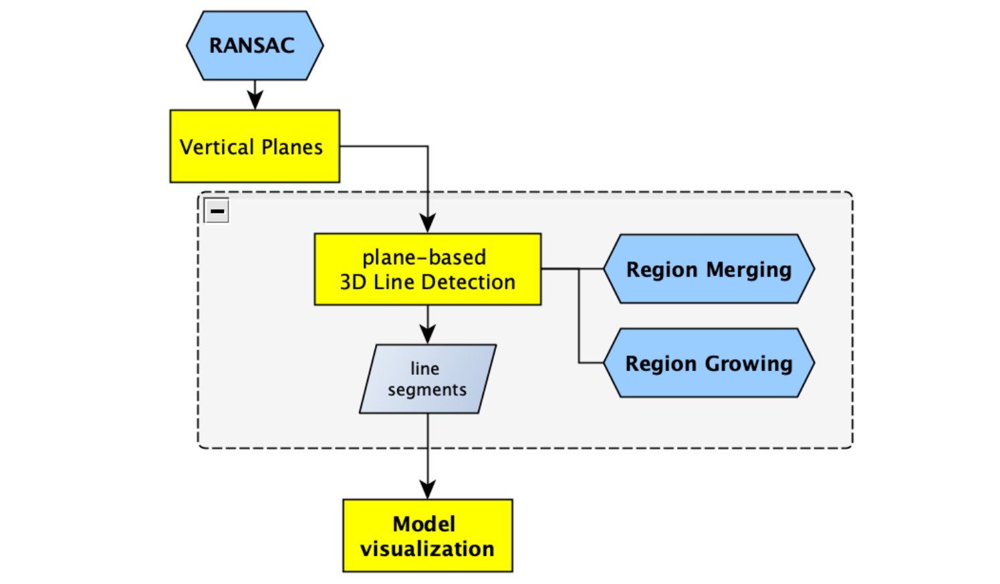

- 3D line detection
- Post-extraction optimization
- Geometric consistency enforcement

### Quantitative Results
**Semantic Segmentation Performance**
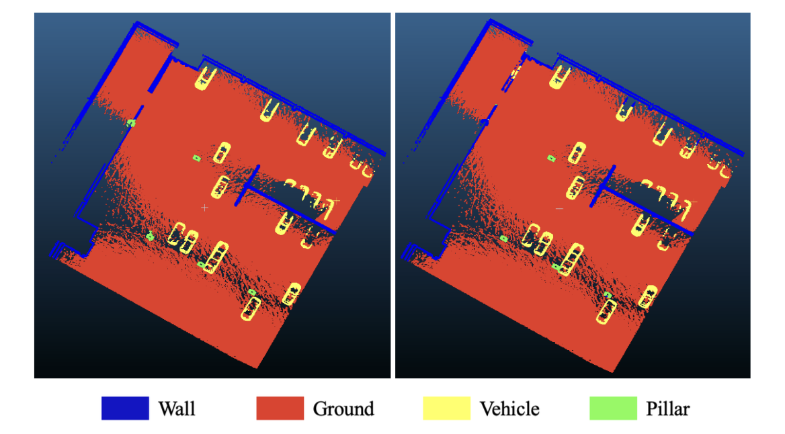

  <table class="perf-table">
    <thead>
      <tr>
        <th>Metric</th>
        <th>Value</th>
      </tr>
    </thead>
    <tbody>
      <tr><td>Average Class IoU</td><td>0.907</td></tr>
      <tr><td>Average F1 Score</td><td>0.949</td></tr>
      <tr><td>Overall Accuracy</td><td><strong>98.65%</strong></td></tr>
    </tbody>
  </table>

The overall accuracy and average F1 score of the model are around
98.65% and 94.88%. The average class Intersection Over Union (IoU) of the model is 90.74%,
with the highest IoU (99.4%) in ‘ground’ and the lowest IoU (86.4%) in ‘pillar’. Similar patterns
are also reflected in the Recall percentage, with the highest recall in ‘ground’ (99.4%) and the
lowest recall in ‘pillar’ (80.1%)

  <table class="perf-table">
    <thead>
      <tr>
        <th>Class</th>
        <th>Precision</th>
        <th>Recall</th>
        <th>Specificity</th>
        <th>F1 Score</th>
      </tr>
    </thead>
    <tbody>
      <tr><td>Wall</td><td>0.963</td><td>0.980</td><td>0.990</td><td>0.971</td></tr>
      <tr><td>Pillar</td><td>0.938</td><td>0.801</td><td>0.999</td><td>0.864</td></tr>
      <tr><td>Vehicle</td><td>0.978</td><td>0.955</td><td>0.999</td><td>0.966</td></tr>
      <tr><td>Ground</td><td>0.995</td><td>0.994</td><td>0.987</td><td>0.994</td></tr>
    </tbody>
  </table>

**Ground** class dominates accuracy (highest density, lowest ambiguity), **Pillar** shows highest misclassification rate (~20% confused as wall). While the Root cause is due to insufficient point density 
and occlusion

**Confusion Matrix**

  
True \ Predicted

  
Wall

  
Pillar

  
Vehicle

  
Ground

  
Wall

  
99,143

  
111

  
491

  
1,398

  
Pillar

  
1,143

  
4,852

  
6

  
56

  
Vehicle

  
804

  
169

  
29,521

  
180

  
Ground

  
1,850

  
39

  
409

  
352,551

The horizontal axis (True Labels) of the confusion matrix represents the ground-truth class labels in the test dataset. 
For each column, the sum of values corresponds to the total number of points for that class, as reported in above table. 
The vertical axis (Predicted Labels) indicates the class labels predicted by the model. Each cell in the matrix records 
the number of instances assigned to a given combination of predicted and true labels. The main diagonal, running from the top 
left to the bottom right, represents correct classifications for each class: 99,143 correctly predicted wall points, 4,852 
pillar points, 29,521 vehicle points, and 352,551 ground points. In contrast, the off-diagonal entries capture misclassifications, 
where points belonging to one class are incorrectly assigned to another.

**Surface Regularization**
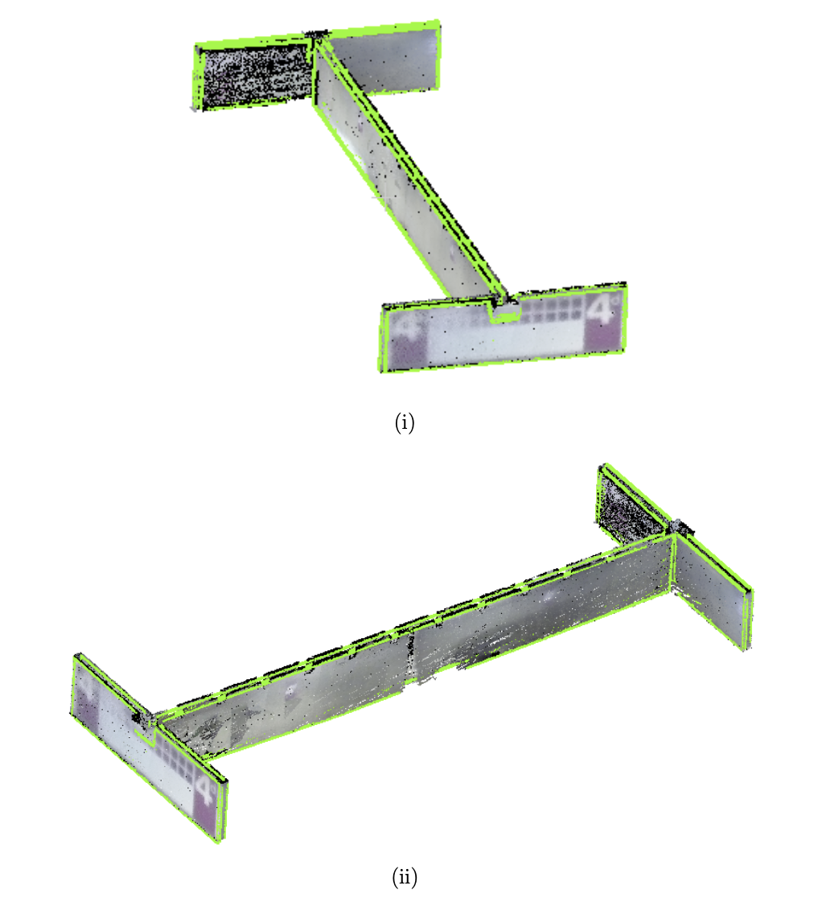
HDBSCAN clustering identified **17** distinct structural clusters after dimensionality reduction from 
[N,12] to [N,3], effectively separating vertical elements (walls and pillars) from horizontal planes (ground). 
This clustering provided a reliable structural prior for downstream surface and line reconstruction. In surface reconstruction, 
the Ball-Pivoting Algorithm (BPA) demonstrated high computational efficiency and performed adequately 
on large planar regions; however, it exhibited notable limitations in occluded areas, frequently producing holes, over-smoothing 
sharp geometric features, and requiring careful ball-radius tuning. In contrast, pyRANSAC-3D multi-plane fitting proved more robust 
to noise and delivered superior plane regularization, resulting in structurally cleaner and more consistent digital twin representations.

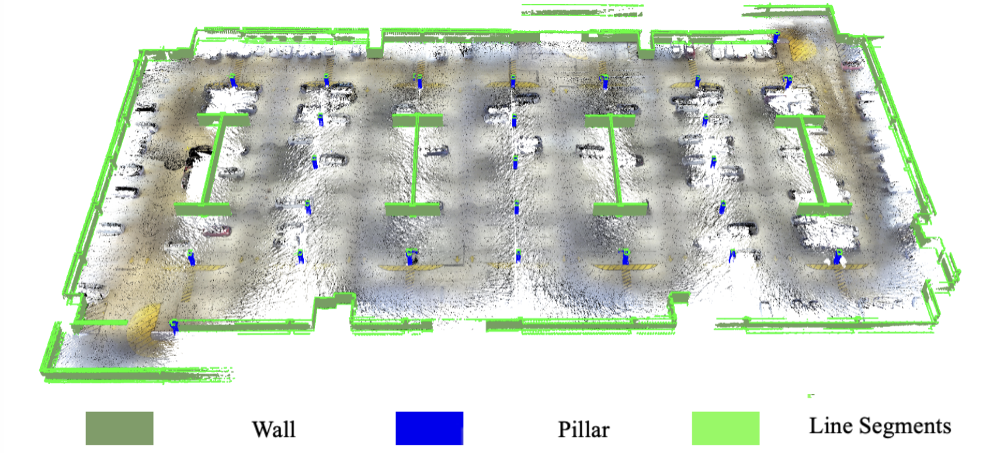

Quantitatively and qualitatively, RANSAC-based plane fitting outperformed BPA for infrastructure-scale indoor modelling, particularly 
where geometric fidelity and structural regularity are critical.

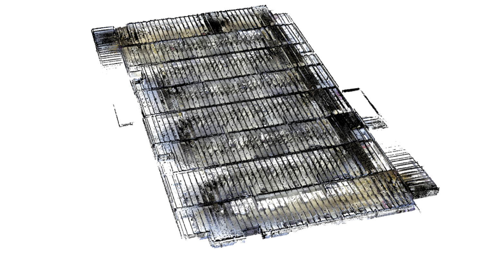

Raw Point Clouds Data

Final 3D Model with Line Features

Subsequent line feature reconstruction from wall-filtered point clouds showed that both plane and line counts scale with input point 
density. Optimized line extraction significantly improved wall continuity, corner sharpness, and overall navigational geometry usability, 
reinforcing its value for downstream indoor mapping and digital twin applications.

### Future Work

Optimized enclosed loop trajectory 01 (**vehicle and pillar focused**)

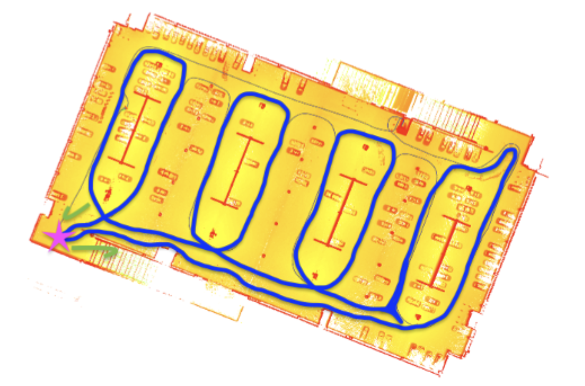

Optimized enclosed loop trajectory 02 (**wall structure focused**)

Enclosed loops in SLAM algorithms play a pivotal role in ensuring the accuracy,
consistency, and efficiency of the map creation and localization process, which are essential for
the reliable operation of autonomous robots and vehicles in dynamic environments. By completing
a closed scan, people can comprehensively analyze related errors that occur in data resolution
and adjust parameters to resolve these errors. Although the big loop in our data collection
was enclosed, partial loops were not enclosed (refer to <a href="#trajectory">Scanning Trajectory</a>), 
this may cause a series of misclosure. To minimize the error caused by IMU drift, optimized routes 
are proposed in Figures above as alternatives to walk the trajectory in enclosed loops. The pink 
start refers to the start/finish spot, the green arrows indicate the moving direction, and the 
purple/ blue line represents the refined trajectory.

To ascertain the accuracy and practicality of the model, it can be integrated into a prototype for
an autonomous last 1-km parking system, followed by a thorough evaluation of its performance. Ensuring 
that the system can identify and avoid these bollards is crucial to avoid any potential interference with 
them. Similarly, the detection of other vehicles is required for the system’s functionality. To enhance the 
model’s capability to recognize such obstacles, the implementation of an object detection algorithm as a subsequent 
step can be considered as a future extention to work on.

### Conclusion
This work presents a novel approach to indoor spatial modelling, with a particular emphasis on generating high-fidelity 
digital twin representations of indoor parking garages. The proposed methodology is built upon a LiDAR-based SLAM system 
that serves as the core data acquisition framework, enabling detailed and accurate capture of complex indoor environments. 
Building on this foundation, advanced algorithms for semantic segmentation, surface reconstruction, and line feature extraction 
are integrated to process raw SLAM outputs and transform point cloud data into a structured, semantically enriched digital 
representation of the physical space.

By demonstrating the end-to-end generation of accurate digital twins in a challenging indoor setting, this work highlights the 
critical role of point cloud–based workflows in indoor digital twin construction. The results validate the feasibility of applying 
digital twin technologies to large-scale indoor infrastructure and establish a robust foundation for future research and deployment 
in complex GNSS-denied environments.