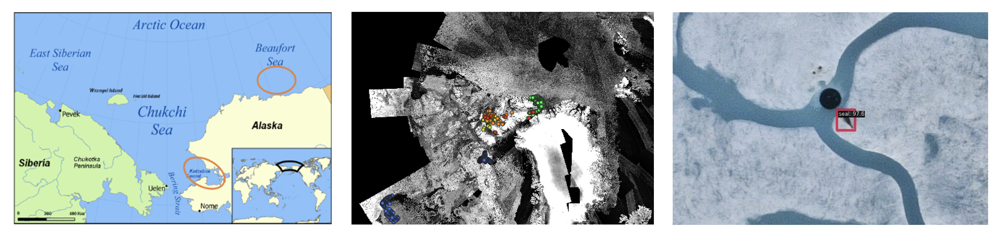
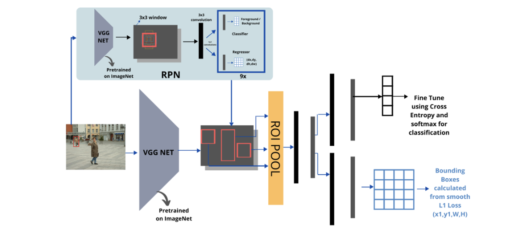
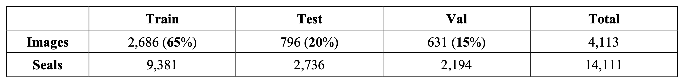
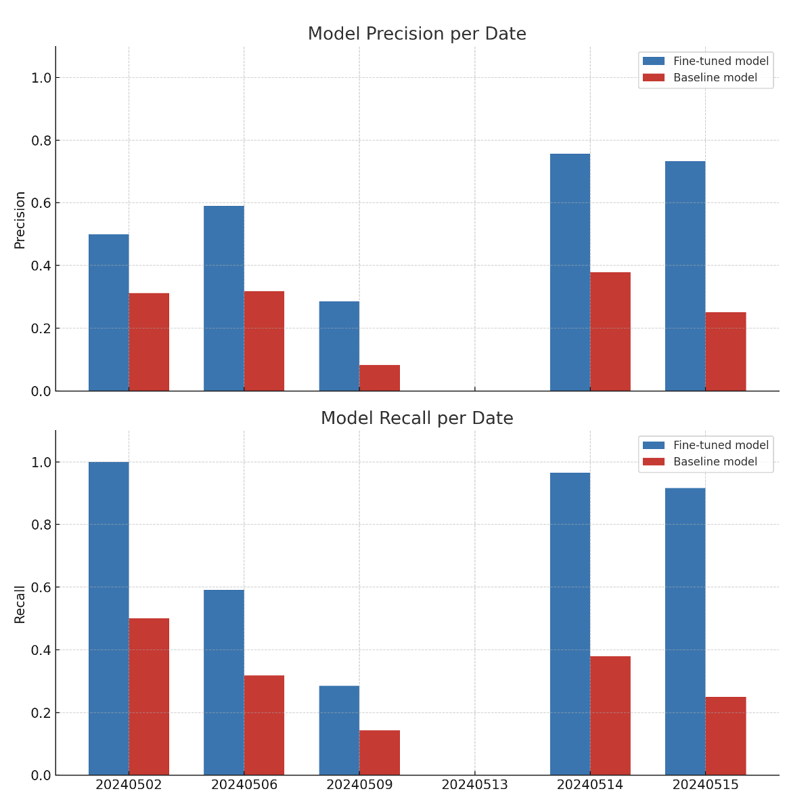
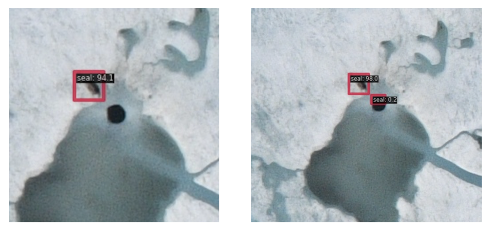

## Introduction
Seal detection is critical for understanding Arctic ecology, monitoring climate change impacts, and supporting
indigenous hunting traditions. Traditional visual counting methods are limited in scalability and efficiency, particularly
in remote Arctic regions. To address these challenges, this study explores the application of AI-based algorithms,
specifically the Faster-RCNN (MMDetection, n.d.) model, for detecting Arctic seals using airborne imagery. Faster R-
CNN was selected due to its robust object detection capabilities and balance between accuracy and computational
efficiency. We investigate the benefits of fine-tuning a pre-trained model on the National Oceanic and Atmospheric
Administration (NOAA) seal dataset using the Department of Fisheries and Oceans (DFO) dataset to improve detection
accuracy on the new airborne imageries collected in Eureka during 2024.

Arctic seals serve as critical ecological indicators and hold deep cultural and subsistence importance for Indigenous communities. 
Monitoring their populations provides valuable insight into sea-ice dynamics, prey availability, and broader climate-driven ecosystem changes.
Modern aerial surveys can generate tens of thousands of images, making manual analysis impractical. To address this, we explore the use of 
AI-based object detection, specifically the Faster R-CNN framework, to automate seal detection and improve monitoring scalability.

## Research Objectives
The primary objective of this study is to evaluate how effectively an AI-based object detection model can generalize across different Arctic environments.

Specifically, we investigate:

1. How well a model trained in one region performs in another
2. The impact of regional fine-tuning on detection performance
3. The feasibility of scalable AI-assisted ecological monitoring

The study focuses on domain adaptation challenges in remote sensing, where environmental conditions vary significantly across geographic regions.

## Dataset Overview

This project integrates three major datasets representing different geographic contexts.

1. NOAA Arctic Seal Dataset (2019): Over 80,000 aerial images collected in Alaska. Approximately 4,000 labeled images containing seal annotations. 
Used for baseline model training.

2. Fisheries and Oceans Canada (DFO) Dataset (2018–2023): 2,322 aerial survey records across the Canadian Arctic. Region-specific environmental conditions. 
Used for domain adaptation and fine-tuning

3. Eureka Test Dataset (2024): 26,989 high-resolution aerial photos. Completely unseen by the model. Represents realistic operational deployment conditions.

## Faster R-CNN Framework

The detection framework is based on Faster R-CNN, chosen for its balance between detection accuracy and computational efficiency.

## Baseline Training

The baseline model was trained exclusively on the NOAA dataset.

Training configuration included: 1. data augmentation (flipping, compression, color adjustment); 2. dataset split into training, validation, and test subsets; 3. 
hyperparameter tuning for initial performance optimization.

## Domain Adaptation via Fine-Tuning

Seal appearance varies significantly across regions due to:

1. lighting conditions
2. ice texture differences
3. behavioral patterns
4.environmental backgrounds

To address this, the baseline model was fine-tuned using DFO aerial imagery. Fine-tuning settings included:

1. small learning rate (0.0001)
2. 2 batch size constraints (2)
3. 24 training epochs

This fine-tuning allowed the model to adapt to differences between the NOAA and DFO datasets, such as seal behavior, environment, and imaging conditions. 
By refining the model’s weights, it is expected that the new model can achieve better alignment with the DFO dataset and achieve improved generalization performance. 

## Evaluation Metrics

Model performance was evaluated on the unseen Eureka dataset using standard detection metrics:

- Precision — proportion of correct detections
- Recall — proportion of actual seals detected

Recall is particularly important in ecological monitoring, where missing an animal may have greater consequences than false positives.

## Results and Discussion

Fine-tuning produced a substantial improvement in detection performance.

Key findings include:
- Baseline model recall: 52%
- Fine-tuned model recall: 87.7%
- Total seals correctly detected: 150 of 171

The improved recall was accompanied by increased false positives.

Common sources of confusion included:

- breathing holes
- shadows on ice
- dark water patches

This reflects a typical detection trade-off: maximizing recall often increases false positive rates.

## Conclusion

This study demonstrates that domain-adapted Faster R-CNN models can significantly enhance large-scale ecological monitoring workflows.

Fine-tuning with region-specific datasets improved recall from 52% to nearly 88%, highlighting the importance of localized training data in remote sensing applications.

As aerial survey volumes continue to increase, AI-assisted detection systems will play a critical role in enabling scalable, consistent, and data-driven wildlife monitoring.