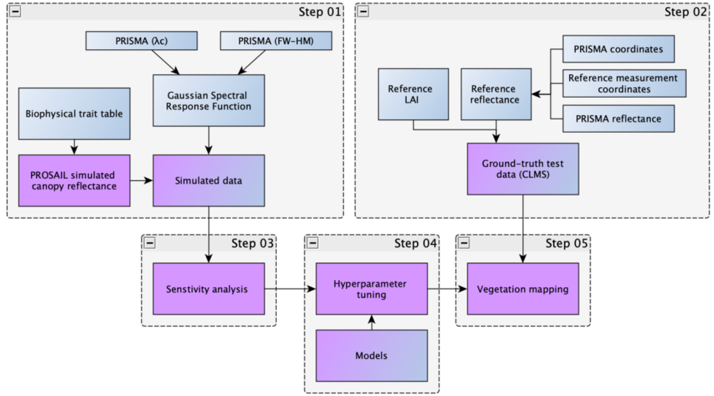
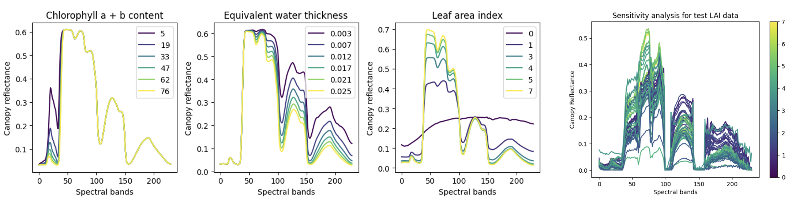

import img01_a from "./img/p6:3a.png";
import img01_b from "./img/p6:3b.png";
import img01_c from "./img/p6_3c.png";
import img01_d from "./img/p6_3d.png";

import img02_a from "./img/p6_4a.png";
import img02_b from "./img/p6_4b.png";
import img02_c from "./img/p6_4c.png";
import img02_d from "./img/p6_4d.png";

### Background

This project evaluates the effectiveness of PRISMA hyperspectral imagery for **leaf area index (LAI)** estimation and 
vegetation trait mapping. By integrating PROSAIL radiative transfer simulations, ground-truth LAI measurements, 
and machine-learning regression models, we benchmark accuracy, robustness, and spatial consistency across multiple experimental 
configurations.

The Leaf Area Index (LAI) is a critical indicator for understanding vegetation health, ecosystem monitoring, and precision agriculture. 
However, current methods for detecting LAI face challenges such as sensitivity to environmental variations and inaccuracies in modeling 
approaches. Hyperspectral remote sensing data provides a solution by capturing detailed spectral information, enabling the analysis of 
key biophysical traits such as chlorophyll and water content. Our study addresses these challenges by developing an integrated approach 
that combines PROSAIL modeling, sensitivity analysis to improve LAI detection accuracy and vegetation mapping.

**Objective:**  Design a **robust, reproducible pipeline** that improves LAI prediction accuracy while remaining operationally scalable.

### Methodology Overview

The workflow consists of five tightly-coupled stages:

##### Step 01 — PROSAIL Simulation

  <table class="perf-table">
    <thead>
      <tr>
        <th scope="col">Description</th>
        <th scope="col">Units</th>
        <th scope="col">Parameter</th>
        <th scope="col">Min</th>
        <th scope="col">Max</th>
      </tr>
    </thead>

    <tbody>
      <tr>
        <td>Chlorophyll a + b content</td>
        <td>ug/cm2</td>
        <td>Cab</td>
        <td>5</td>
        <td>90</td>
      </tr>

      <tr>
        <td>Equivalent water thickness</td>
        <td>cm</td>
        <td>Cw</td>
        <td>0.003</td>
        <td>0.03</td>
      </tr>

      <tr>
        <td>Leaf area index</td>
        <td>–</td>
        <td>LAI</td>
        <td>0.01</td>
        <td>8</td>
      </tr>

      <tr>
        <td>Leaf structure index</td>
        <td>–</td>
        <td>N</td>
        <td>1</td>
        <td>3.5</td>
      </tr>

      <tr>
        <td>Carotenoid concentration</td>
        <td>ug/cm2</td>
        <td>Car</td>
        <td>1</td>
        <td>20</td>
      </tr>

      <tr>
        <td>Brown pigment</td>
        <td>–</td>
        <td>Cbrown</td>
        <td>0</td>
        <td>1</td>
      </tr>

      <tr>
        <td>Dry matter content</td>
        <td>g/cm2</td>
        <td>Cm</td>
        <td>0.002</td>
        <td>0.01</td>
      </tr>

      <tr>
        <td>Average leaf angle (Ellipsoidal distribution)</td>
        <td>–</td>
        <td>LIDFa</td>
        <td>0</td>
        <td>90</td>
      </tr>

      <tr>
        <td>Dry/Wet soil factor</td>
        <td>–</td>
        <td>&rho;soil</td>
        <td>0.5</td>
        <td>1.5</td>
      </tr>

      <tr>
        <td>Soil brightness factor</td>
        <td>–</td>
        <td>&alpha;soil</td>
        <td>0</td>
        <td>1</td>
      </tr>

      <tr>
        <td>Hotspot parameter</td>
        <td>–</td>
        <td>hspot</td>
        <td>0</td>
        <td>3.5</td>
      </tr>

      <tr>
        <td>Solar zenith angle</td>
        <td>deg</td>
        <td>tts</td>
        <td>0</td>
        <td>70</td>
      </tr>

      <tr>
        <td>Observer zenith angle</td>
        <td>deg</td>
        <td>tto</td>
        <td>0</td>
        <td>90</td>
      </tr>

      <tr>
        <td>Relative azimuth angle</td>
        <td>deg</td>
        <td>phi</td>
        <td>0</td>
        <td>90</td>
      </tr>
    </tbody>
  </table>

We initiated the simulation process by defining a biophysical traits table. Unlike fixing the traits, our approach allows for a broader exploration 
of parameter space, which is crucial for capturing real-world variations in vegetation. This ensures that the simulated reflectance closely aligns 
with the complexities of natural vegetation. Importantly, we maintain uniform parameter distributions and random concatenation across the desired size to avoid introducing artificial biases. 
This approach guarantees that our simulations accurately represent the range of real-world scenarios.

We used a common radiative transfer model named **PROSAIL** to stimulate the process.

- Generated PRISMA-like hyperspectral reflectance using the **PROSAIL RTM**.
- Simulated variability across **LAI**, **chlorophyll content (Cab)**, and **water thickness (Cw)**.
- Provided a controlled baseline for sensitivity testing and model training.

---

##### Step 02 — Ground-Truth Preprocessing

To ensure the accuracy of our study, we collected trustworthy LAI (Leaf Area Index) data from **29** locations as part of the Ground-Based Observations for 
validation program through the Copernicus Land Monitoring Service. These measurements were taken between December 2020 and May 2022. 

We carefully selected data by removing entries without precise coordinates, ensuring exact location accuracy. Matched with **PRISMA L2D scenes** using:
  - ±3-day temporal window  
  - ≤15% cloud cover
  - Reflectance normalization (zero bands removed for consistency)

A high-quality subset of **50 test samples from 8 sites** shown below was reserved for validation.

  <table class="perf-table">
    <thead>
      <tr>
        <th scope="col">Site</th>
        <th scope="col">Land Cover Type</th>
        <th scope="col">Reference Measurements</th>
        <th scope="col">PRISMA Images Acquired</th>
      </tr>
    </thead>

    <tbody>
      <tr>
        <td>Bartlett Experimental Forest</td>
        <td>Mixed Forest</td>
        <td>5</td>
        <td>1</td>
      </tr>

      <tr>
        <td>Guanica Forest</td>
        <td>Evergreen Broadleaf</td>
        <td>3</td>
        <td>1</td>
      </tr>

      <tr>
        <td>Harvard Forest</td>
        <td>Mixed Forest</td>
        <td>5</td>
        <td>2</td>
      </tr>

      <tr>
        <td>Oak Ridge</td>
        <td>Mixed Forest</td>
        <td>3</td>
        <td>1</td>
      </tr>

      <tr>
        <td>Ordway Swisher Biological Station</td>
        <td>Evergreen Needleleaf</td>
        <td>8–2</td>
        <td>3</td>
      </tr>

      <tr>
        <td>Smithsonian Conservation Biology Institute</td>
        <td>Mixed Forest</td>
        <td>2–1</td>
        <td>2</td>
      </tr>

      <tr>
        <td>Talladega National Forest</td>
        <td>Evergreen Needleleaf</td>
        <td>11</td>
        <td>4</td>
      </tr>

      <tr>
        <td>Underc</td>
        <td>Mixed Forest</td>
        <td>7–1</td>
        <td>3</td>
      </tr>
    </tbody>
  </table>

---

##### Step 03 — Sensitivity Analysis

- Evaluated spectral sensitivity of LAI across **400–2500 nm**.
- Assessed interactions between LAI, **C**ab, and **C**w.
- Analysis performed on:
  - Simulated PRISMA reflectance  
  - Ground-truth LAI test data

This step informed **band importance** and model configuration choices:

Accordingly to above, Chlorophyll influences the visible spectrum—particularly near the blue (430–450 nm) and red (640–680 nm) bands due to chlorophyll absorption.
Water thickness affects reflectance in the 100–150 spectral band, linked to water absorption in the shortwave infrared.
LAI impacts reflectance across the full spectrum, especially as canopy density increases.

To validate the simulation, we compared this against ground-truth test data (graph on the top right).
This step was crucial to identify sensitive bands and confirm that simulated reflectance aligns with real-world observations—setting the stage for our model training and mapping work.

---

##### Step 04 — Hyperparameter Tuning

- Models evaluated:
  - Random Forest (RF)
  - Artificial Neural Network (ANN)
  - Gaussian Process Regression (GPR)

Training conducted on datasets of varying sizes including **50 / 100 / 200 / 500 samples**. Each dataset underwent 50 initialization cycles with 5-fold cross-validation.
R-squared measures how well the model's predictions align with actual observations, indicating goodness of fit; higher scores signify better performance.

**Objective**: ensure fair comparison and prevent overfitting under limited data regimes.

  <table class="perf-table">
    <thead>
      <tr>
        <th scope="col">Model</th>
        <th scope="col">Hyperparameter</th>
        <th scope="col">Values Tested</th>
      </tr>
    </thead>

    <tbody>
      <tr>
        <td rowspan="4"><strong>Multilayer Perceptron (MLP)</strong></td>
        <td>Hidden layer sizes</td>
        <td>64, 128, 256 (single-layer); combinations for multi-layer</td>
      </tr>
      <tr>
        <td>Activation functions</td>
        <td>ReLU, Tanh</td>
      </tr>
      <tr>
        <td>Initial learning rate</td>
        <td>0.01, 0.001</td>
      </tr>
      <tr>
        <td>Maximum iterations</td>
        <td>50, 100, 500</td>
      </tr>

      <tr>
        <td rowspan="2"><strong>Gaussian Process Regressor (GPR)</strong></td>
        <td>Kernel</td>
        <td>Matern, RBF, Rational Quadratic</td>
      </tr>
      <tr>
        <td>Target normalization</td>
        <td>True, False</td>
      </tr>

      <tr>
        <td rowspan="2"><strong>Random Forest Regressor (RDF)</strong></td>
        <td>Max depth</td>
        <td>None, 10, 50, 100, 500</td>
      </tr>
      <tr>
        <td>Number of estimators</td>
        <td>10, 50, 100</td>
      </tr>
    </tbody>
  </table>

Building on these insights, we systematically tested combinations of hyperparameters within a predefined search space to identify the optimal settings 
for each model. The explored hyperparameter space for different models are demonstrated in the table above.

---

##### Step 05 — Vegetation Trait Mapping

To evaluate model robustness and consistency, we defined four experimental configurations based on PROSAIL preprocessing choices: normalized vs. unnormalized 
inputs and fixed vs. unfixed parameters. This factorial design isolates the effects of parameter flexibility and spectral normalization on predictive performance. 
Each model was trained and evaluated across all four configurations, enabling a systematic comparison of accuracy, stability, and sensitivity to input conditions.

  <table class="perf-table">
    <thead>
      <tr>
        <th scope="col">Code</th>
        <th scope="col">Description</th>
      </tr>
    </thead>

    <tbody>
      <tr>
        <td><strong>N-F</strong></td>
        <td>Normalized + Fixed parameters</td>
      </tr>

      <tr>
        <td><strong>N-U</strong></td>
        <td>Normalized + Unfixed parameters</td>
      </tr>

      <tr>
        <td><strong>U-F</strong></td>
        <td>Unnormalized + Fixed parameters</td>
      </tr>

      <tr>
        <td><strong>U-U</strong></td>
        <td>Unnormalized + Unfixed parameters</td>
      </tr>
    </tbody>
  </table>

  

    

    
Unnormalized PROSAIL (U)

    
Normalized PROSAIL (N)

    
<strong>Unfixed parameter (U)</strong>

    

      
    

    

      
    

    
<strong>Fixed parameter (F)</strong>

    

      
    

    

      
    

  

Each row shows predictions for a different biophysical trait—chlorophyll (Cab), water content (Cw), and LAI. Columns in each block shows the performance of 
three machine learning models. The GPR model, shown in the third column of each block, consistently yields the highest R-squared and lowest RMSE values. The 
fixed-parameter configurations, particularly when combined with normalized inputs, exhibit tightly clustered predictions along the 1:1 line, reflecting improved 
stability and reduced variance. In contrast, unfixed configurations, especially under unnormalized conditions, show increased scatter and noise, indicating reduced 
precision despite greater flexibility.

  

    

    
Unnormalized PROSAIL (U)

    
Normalized PROSAIL (N)

    
<strong>Unfixed parameter (U)</strong>

    

      
    

    

      
    

    
<strong>Fixed parameter (F)</strong>

    

      
    

    

      
    

  

Spatial trait maps reinforce these statistical trends. The normalized–fixed (N-F) configuration produces the most coherent spatial patterns, characterized by smooth 
gradients, well-defined field boundaries, and minimal artifacts. Conversely, the unnormalized–unfixed (U-U) configuration yields noisier maps with patchy and less 
interpretable structures. These results highlight a clear tradeoff between model generalization and spatial reliability: while unfixed configurations capture broader 
variability, fixed and normalized inputs provide more robust and spatially consistent trait estimates, which are critical for downstream applications such as yield modeling, 
crop monitoring, and early stress detection.

### Results

Across all experimental configurations, Gaussian Process Regression (GPR) consistently outperformed both Artificial Neural Networks (ANNs) and Random Forests in prediction 
accuracy, achieving the highest R² values and lowest RMSE. This indicates that GPR provides estimates that are both precise and reliable across varying input conditions.

The normalized–fixed (N-F) configuration yielded the most stable and consistent results, reflected in both statistical metrics and spatial trait maps. In contrast, unfixed 
parameter setups introduced greater uncertainty and visible spatial noise, particularly in unnormalized cases, leading to reduced interpretability.

Overall, the PROSAIL–machine learning hybrid framework demonstrates clear improvements in LAI estimation under real-world conditions. Among the evaluated models, GPR emerged 
as the most effective approach for capturing nonlinear relationships and managing uncertainty in hyperspectral vegetation data.

### Key highlights
- **Model choice matters**: GPR is best suited for hyperspectral LAI retrieval under limited samples.
- **Preprocessing is not optional**: normalization materially improves robustness.
- **Parameter control beats flexibility** for operational mapping.
- The proposed pipeline is **transferable** to other crops and regions with minimal adaptation.

---

 *Presented at CSRS 2025 · Lethbridge, Alberta, Canada*  

