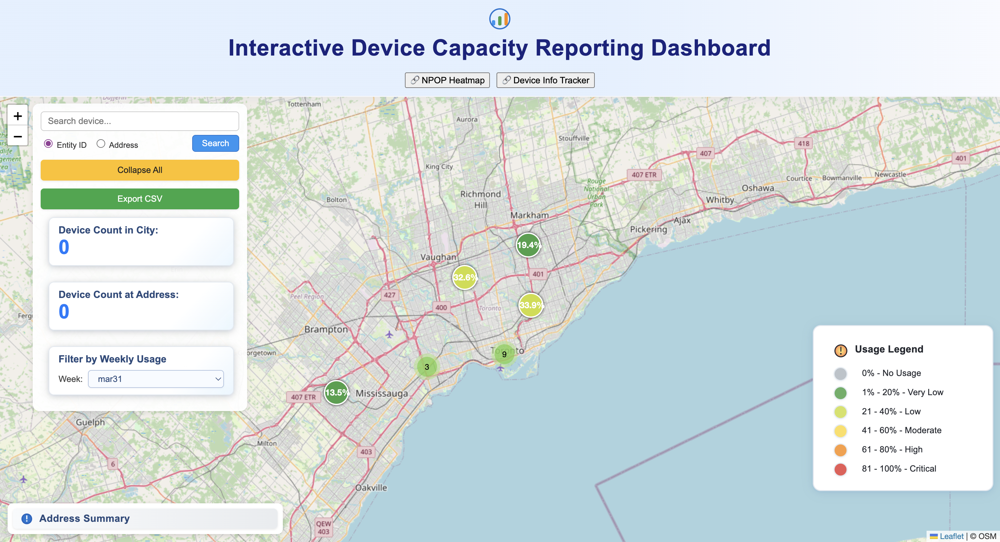
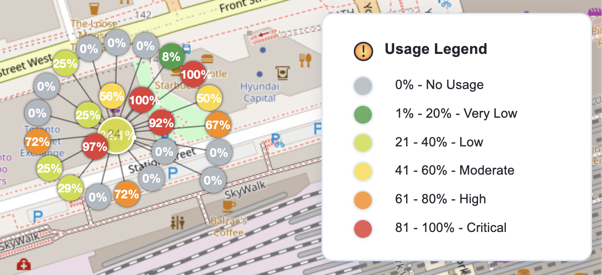
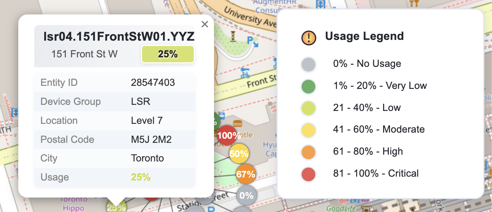
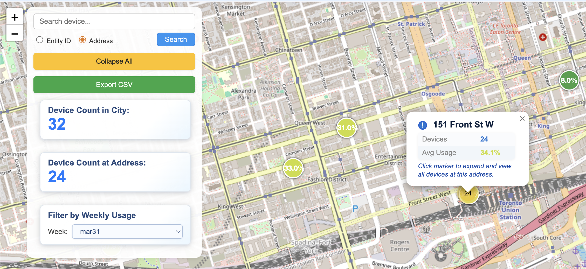
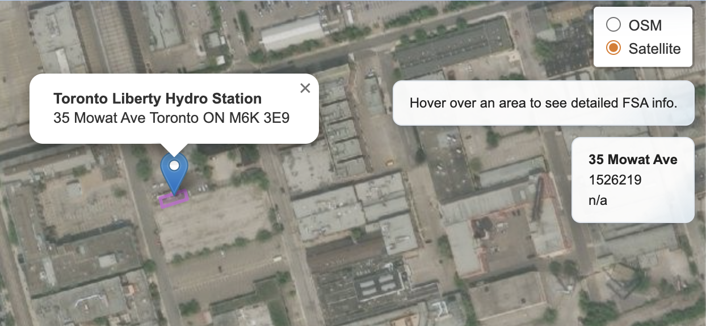
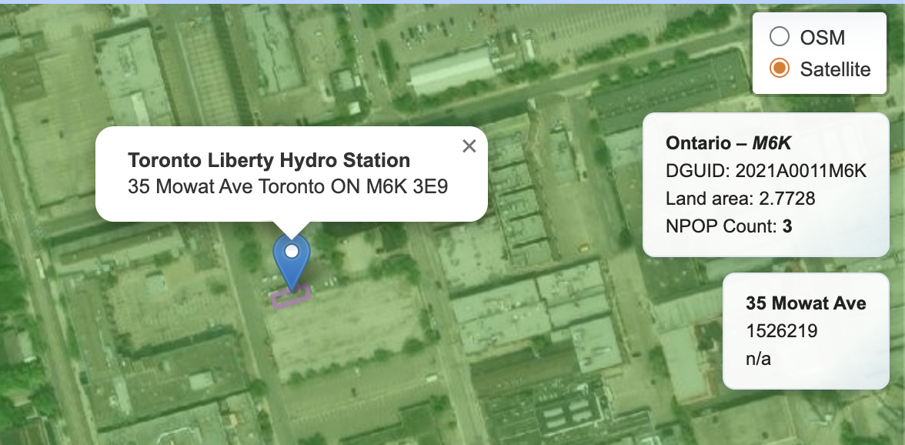

## Background

In large infrastructure networks, the core challenge is rarely data availability, it is transforming fragmented operational records into timely, decision-ready insights.

When I first began working with fiber capacity datasets, reporting workflows were entirely manual:

1. Export data from multiple operational systems
2. Resolve inconsistencies across sources
3. Generate static maps and reports
4. Distribute results to planners

This process was slow, repetitive, and difficult to scale. More importantly, it lacked a real-time spatial intelligence layer capable of translating raw infrastructure data into interactive, actionable insights.

This project documents the design and implementation of a web-based geospatial dashboard system that addresses this gap using:

- Leaflet.js for interactive visualization
- PostGIS for spatial data management
- Automated ETL pipelines for continuous data updates

## Challenges

Fiber capacity data presents several unique engineering challenges:

- Large-scale network topology with hierarchical spatial relationships
- Continuous updates from operational systems
- Multiple performance metrics linked to each asset
- Need for near real-time decision support

Planners needed to answer critical operational questions:

1. Which network corridors are approaching capacity limits?
2. Where should infrastructure investment be prioritized?
3. How do capacity constraints evolve spatially over time?

{/* Traditional static reporting workflows could not support these requirements due to: 
- Long reporting cycles; 
- Limited interactivity; 
- Difficult cross-layer analysis; 
- High manual effort. */}

## Architecture Overview

The system was designed as a lightweight yet scalable spatial analytics architecture capable of supporting continuous infrastructure monitoring. Key components include:

1. **Spatial Database & API Layer**: Developed a PostGIS-based spatial database to store and maintain fiber network topology and capacity metrics; Optimized spatial indexing and query pipelines to enable fast, scalable retrieval for real-time Leaflet-based visualization and analysis.

2. **Backend Data Pipeline**: Automated ETL scripts process raw infrastructure datasets; Cleaned, standardized, and updated network attributes regularly.

3. **Cron Job Scheduling**: Set up cron jobs to trigger data pipeline execution and ensure the dashboard reflects the latest network conditions.

4. **Frontend Visualization**: Leaflet.js renders interactive map layers; Dynamic styling reflects capacity conditions.

## Dashboard System Overview

This project consists of three integrated dashboards designed to support infrastructure monitoring, operational analytics, and capacity planning across the fiber network ecosystem:

Provides a high-level spatial overview of network point-of-presence (NPoP) distribution, enabling quick identification of geographic density patterns and infrastructure concentration using heatmap visualization.

Supports operational decision-making by visualizing real-time device utilization metrics, allowing planners to monitor capacity thresholds, identify congestion risks, and prioritize resource allocation.

Offers detailed, entity-level inspection capabilities, enabling interactive querying, status validation, and weekly usage tracking for individual network devices.

Together, these dashboards form a scalable decision-support system that bridges high-level spatial intelligence with granular operational data insights.

## Key Features & Functionality

This interface provides a real-time overview of network utilization across city infrastructure. Planners can quickly identify high-load corridors through intuitive color-coded capacity indicators.

Using the `Leaflet.markercluster` plugin, thousands of device points are aggregated in real time, enabling smooth interaction and reducing visual clutter without sacrificing spatial detail.

**Context-Rich Infrastructure Metadata**

Clicking a marker exposes detailed device attributes, supporting deeper diagnostics and infrastructure-level analysis directly within the spatial interface.

**Interactive Infrastructure Metadata Panel**

Marker selection triggers a dynamic popup displaying device attributes and utilization metrics, allowing real-time inspection of network asset status.

**Spatial Demand Density Mapping**

A heatmap layer visualizes spatial patterns of infrastructure demand, highlighting areas of high utilization and potential bottlenecks across the network. Heatmap visualization reveals infrastructure demand concentration patterns, supporting strategic capacity planning and resource allocation.

**Infrastructure Asset Location Context**

Individual facilities can be examined within their geographic surroundings, improving spatial situational awareness for operational teams.

## Key Engineering Insights

Building this system changed how I think about spatial data work.

One of the biggest realizations was that spatial data engineering is not really about data itself, it’s about time. In operational environments, the value of infrastructure data 
depends on how quickly it can be turned into something usable for decisions. Even accurate datasets become meaningless if they take weeks to interpret.

Another lesson was the importance of reproducibility. Real-world infrastructure data is messy, constantly changing, and rarely standardized. Without automated pipelines, maintaining 
consistency across reporting cycles quickly becomes unsustainable. Reliable ETL workflows turned out to be just as critical as the analytics itself.

Finally, I saw firsthand how much interface design influences decision-making. Static reports force people to think linearly, while interactive spatial dashboards allow planners to 
explore patterns, zoom into anomalies, and move between system-level and asset-level views naturally.

Together, these experiences reinforced a broader perspective: effective geospatial systems are not just about storage or visualization alone — they require tight integration between 
spatial databases, automated pipelines, and intuitive interfaces to truly support real-world decision processes.

