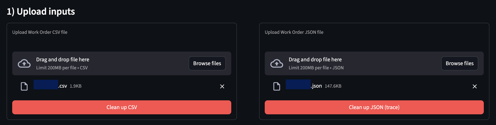
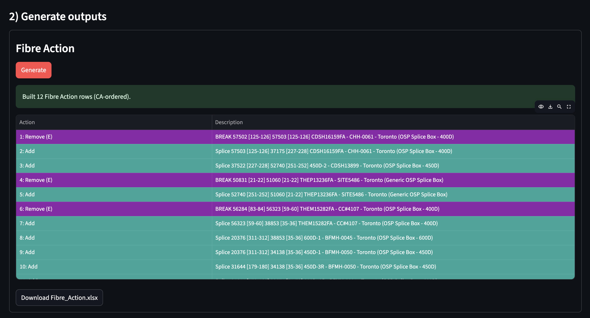
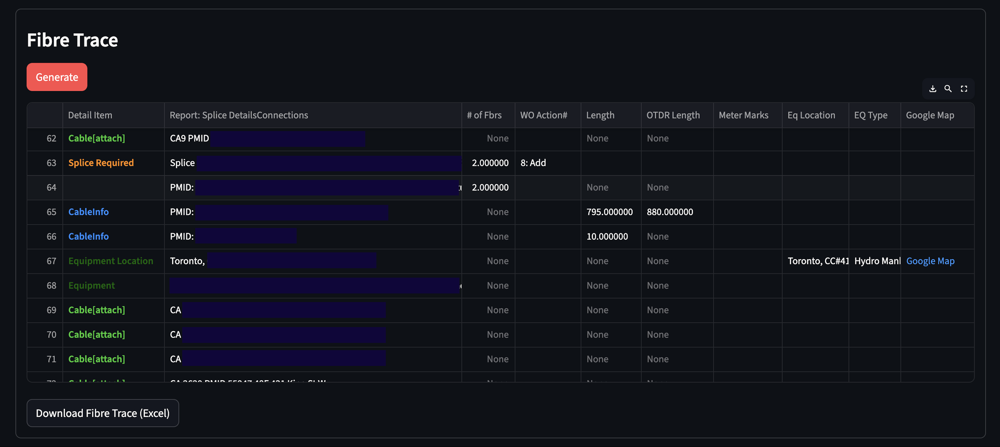
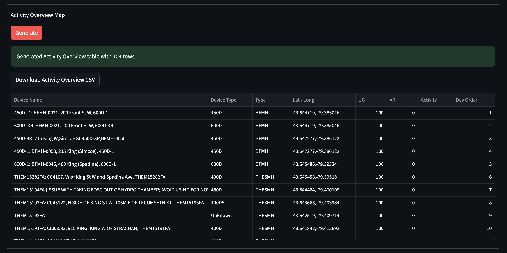
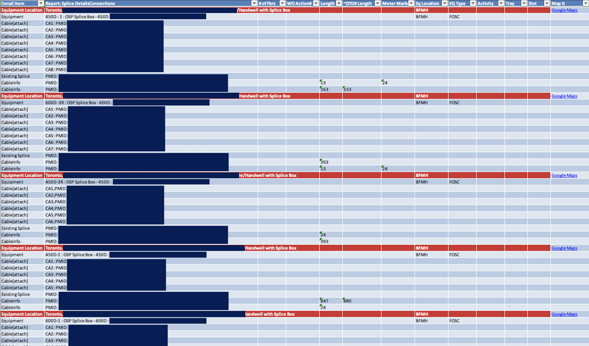

# 

**SmartTrace** is a Python-based automation tool that transforms raw Work Order (WO) files and circuit JSON exports into structured, engineer-ready Excel reports and KML files. 
The project was designed to eliminate repetitive manual processing when generating fibre trace documentation especially splice details, device summaries, action logs, and geospatial references.


👉 Source Code: https://github.com/Kristiehu/SmartTrace

---

## Problem Statement

In fibre network operations, generating a complete trace report typically involves:

- Parsing Work Order CSVs
- Extracting metadata (Order ID, Designer, A/Z end, etc.)
- Interpreting large “Connections” text blobs from circuit JSON
- Counting fibre breaks and splices
- Extracting cable lengths and OTDR values
- Identifying equipment locations
- Generating Excel reports that follow strict internal formatting
- Optionally exporting KML for spatial visualization

This process is time-consuming, error-prone, and difficult to scale as network complexity grows. SmartTrace helpes to automate the entire workflow.

---

## Architecture Overview

The project is modular and organized by responsibility:

```
app/
├── app.py                  # Streamlit UI
├── trace_report.py         # Excel report generation
├── fibre_trace.py          # Splice & cable parsing logic
├── parse_device_sheet.py   # Device extraction from JSON
├── remove_add_algo.py      # Action summary & fibre counts
├── _to_kml.py              # KML export
└── kml_helper.py           # helpers
```

---

## Tech Stack

<dl style="display:grid; grid-template-columns: 220px 1fr; gap: 8px 16px; margin: 12px 0;">
  <dt style="font-weight:600;">Language</dt><dd style="margin:0;">Python 3</dd>
  <dt style="font-weight:600;">UI</dt><dd style="margin:0;">Streamlit</dd>
  <dt style="font-weight:600;">Data Processing</dt><dd style="margin:0;">pandas</dd>
  <dt style="font-weight:600;">Excel Reporting</dt><dd style="margin:0;">openpyxl + xlsxwriter</dd>
  <dt style="font-weight:600;">Geospatial Export</dt><dd style="margin:0;">KML generation</dd>
  <dt style="font-weight:600;">Regex Parsing</dt><dd style="margin:0;">Python <code>re</code> module</dd>
</dl>

---

## Core Functionalities

**1. Data Parsing: Work Orders & Circuit JSON**



The tool extracts structured key-value metadata from WO CSV files:

- Order Number
- Work Order Number
- Designer Info
- A-End / Z-End
- Date
- Circuit Details

It also isolates the **Action / Description / SAP** table for inclusion in the final report.
From the circuit JSON, it parses the large “Connections” text blob to extract:

- Extracts `Connections` blocks
- Decodes encoded tokens (`<COMMA>`, `<COLON>`, etc.)
- Identifies:
  - Equipment Locations
  - Splice Boxes (FOSC)
  - SS / Coil devices
  - Fibre ranges `[1-12]`
  - Cable Length
  - OTDR Length
  - Meter Marks
- Detects latitude & longitude for Google Maps linking

---

**2. Fibre Analytics: Actions, Trace, and Activity Overview Map**






The system automatically computes:

- Number of fibre breaks
- Number of fibre splices
- End-to-end cable length
- Total OTDR length

This eliminates manual counting from long splice descriptions.

---

**3. Excel Report Generation**


Produces a cleaned & structured Excel report:

- Header grid (Order Info + Fibre Metrics)
- Action / Description / SAP table
- Fully formatted cells
- Clean layout matching engineering standards
- Equipment Location
- Equipment Type
- Splice Details
- Cable Attachments
- Length + OTDR metrics
- Google Maps hyperlink (if lat/lon available)

---

**4. KML Export**

Automatically generates KML files for:

- Visualizing fibre routes
- Equipment coordinates
- Mapping trace paths


This enables direct import into Google Earth or GIS platforms.

---

## How to Run

```bash
pip install -r requirements.txt
streamlit run app_v2.py
```


