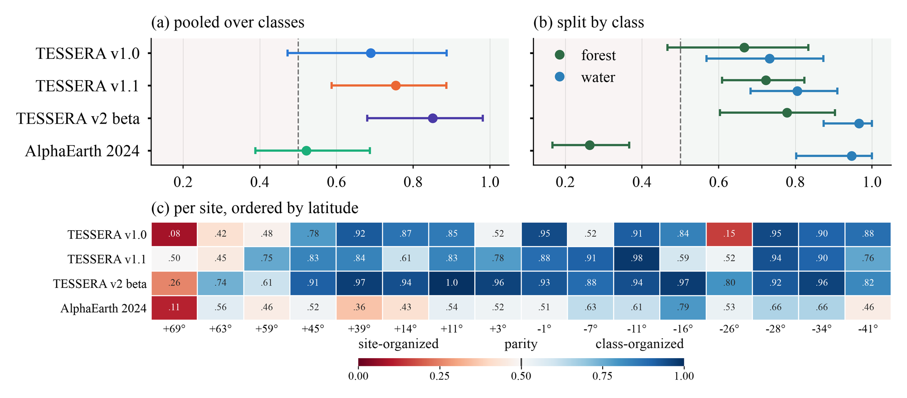

{/* Source: the camera-ready paper (what_vs_where_NeurIPS_2026_camera_ready.pdf, 2026-10-06). Every number here was checked against it on 2026-10-07. */}

## The Question

Earth-observation foundation models turn a year of satellite imagery into a short vector for every pixel, and people now search, cluster and classify with those vectors directly. But is a forest in Finland close to a forest in Brazil in that space, or closer to the lake next to it? And if the same class drifts from place to place, does that hurt the tasks built on top?

We labelled 387 forest and water points at 16 sites between 69°N and 41°S and compared four models: TESSERA v1.0, v1.1 and v2-beta, and AlphaEarth. A simple pair test asks which sit closer: the same class at two different sites, or two different classes at the same site. The result, P, is above 0.5 when an embedding is organised by class and below 0.5 when it is organised by site. Sites, not points, count as the sample size.

## What We Found

- **The models differ sharply.** TESSERA v2-beta is clearly organised by class (P = 0.85); AlphaEarth sits near the boundary (P = 0.52).
- **A pooled number can hide a reversal.** AlphaEarth's 0.52 combines water organised by class (P = 0.95) with forest organised by site (P = 0.26, at 15 of 16 sites).
- **The same class drifts with distance.** Same-class points sit further apart in embedding space when their sites are far apart than when they are close.
- **But it doesn't hurt classification here.** All four models classify forest and water perfectly at sites they were not trained on, accuracy shows no consistent decline with distance, and the more sites a classifier is trained on, the less it matters which ones.

*(a) P for each model with 98.75% confidence intervals; above 0.5 means organised by class. (b) The same, split into forest and water. (c) P at each site from north to south: blue is class-organised, red is site-organised.*

## What I Took Away

Drift in an embedding does not automatically mean poor transfer: four models that look very different when you compare raw distances all reach perfect accuracy once a classifier is trained on top. So test a model the way you'll use it. If an application searches or clusters embeddings directly, check what sits near what; if it trains a classifier, check how it does at new sites.

The test is deliberately simple. Forest versus water is an easy contrast, 16 sites is sparse coverage, and a boreal forest really does differ from a tropical one, so part of the drift may be real ecology rather than location. The open question is when, and for which tasks, the drift starts to matter.

A companion preprint led by Peiwen Zhang, [Recoverable Geographic Location Information in Earth-Observation Embeddings](https://arxiv.org/abs/2609.29151), asks the inverse question: how much location can be recovered from these embeddings at all.

*Hu, K., Knezevic, J., Zhang, P., Yin, S., Li, J., & Gao, K. (2026). What or Where? Class–Site Geometry and Geographic Transfer in Geospatial Embeddings. NeurIPS 2026 Workshop on Advances in Representation Learning for Earth Observation (REO-2).*
